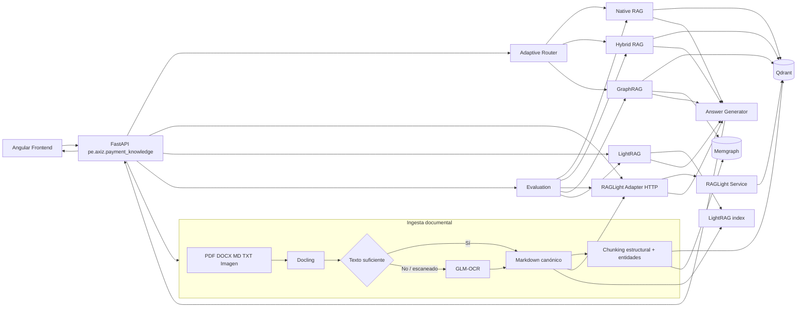

# Adaptive RAG & GraphRAG para Payment Knowledge

Esta PoC prueba una arquitectura de conocimiento documental para payment processing. El objetivo es comparar varias formas de recuperar 
información sobre el mismo corpus y poder ver por qué una estrategia funciona mejor que otra según el tipo de pregunta.

La aplicación procesa documentos con Docling, usa GLM-OCR como ruta OCR cuando el contenido viene escaneado o la extracción normal 
no alcanza un mínimo de texto, construye una representación vectorial en Qdrant y un grafo de conocimiento en Memgraph, y expone cinco estrategias de recuperación: Native RAG, Hybrid RAG, RAGLight, GraphRAG y LightRAG. En modo `auto`, un router decide entre recuperación semántica, híbrida o GraphRAG según señales observables de la consulta. RAGLight corre en un servicio Python separado para aislar su árbol de dependencias del backend principal y poder mantener Docling y RAGLight en versiones actuales sin forzar paquetes incompatibles en el mismo entorno.

## Caso de uso

El caso funcional está centrado en soporte técnico y operativo de pagos. El corpus de ejemplo incluye autorización ISO 8583, códigos de rechazo, conciliación, idempotencia, tokenización y controles PCI. Algunas preguntas se resuelven mejor por similitud semántica, otras necesitan conservar términos exactos como `05` o `ISO 8583`, y otras requieren relacionar conceptos como autorización, adquirente y conciliación.

La PoC permite probar estos caminos sobre el mismo conjunto de documentos:

| Estrategia | Qué implementa | Cuándo aporta más |
| --- | --- | --- |
| Native RAG | embedding denso + búsqueda vectorial en Qdrant | preguntas semánticas |
| Hybrid RAG | ranking vectorial + ranking lexical + Reciprocal Rank Fusion | códigos, términos exactos y consultas mixtas |
| RAGLight | flujo alterno con RAGLight, Qdrant y búsqueda híbrida BM25 + semántica + RRF | comparar implementación propia contra framework |
| GraphRAG | búsqueda híbrida + entidades/relaciones y expansión de un salto en Memgraph | relaciones, dependencias y flujo de componentes |
| LightRAG | flujo graph-RAG alternativo usando LightRAG SDK | comparar otra estrategia basada en grafo |
| Adaptive Routing | reglas explícitas sobre señales de la pregunta | seleccionar estrategia sin que el cliente conozca la implementación |

La comparación no pretende declarar un ganador universal. El endpoint de evaluación mide `Hit Rate`, `MRR` y latencia de retrieval contra un pequeño set controlado incluido en `datasets/evaluation/questions.json`.

## Tecnologías y versiones

Las versiones principales están fijadas para evitar cambios sorpresivos. Docling y RAGLight se ejecutan en procesos Python distintos porque sus dependencias de CLI no son compatibles entre sí en las versiones seleccionadas: Docling 2.130.0 termina requiriendo `typer>=0.19,<0.27`, mientras RAGLight 3.4.7 fija `typer==0.16.0`. En vez de degradar una de las dos tecnologías, la PoC las aísla y las conecta por HTTP.

| Componente | Versión usada |
| --- | ---: |
| Python | 3.12+ y < 3.14 |
| FastAPI | 0.141.1 |
| Uvicorn | 0.54.0 |
| Pydantic | 2.13.5 |
| Pydantic Settings | 2.15.0 |
| Docling | 2.130.0 |
| GLM-OCR SDK | 0.1.5 (solo MaaS/compatibilidad; selfhosted usa HTTP directo a vLLM) |
| Qdrant Server | 1.18.3 |
| qdrant-client backend | 1.19.1 |
| qdrant-client RAGLight | 1.17.0 (dependencia fijada por RAGLight 3.4.7) |
| Memgraph | 3.13.1 |
| Neo4j Python Driver | 6.3.1, usado solo como cliente Bolt para Memgraph |
| RAGLight | 3.4.7 |
| LangGraph en RAGLight | 1.0.5 |
| langgraph-prebuilt en RAGLight | 1.0.5 |
| langgraph-checkpoint en RAGLight | 3.0.1 |
| langgraph-sdk en RAGLight | 0.3.0 |
| LightRAG | 1.5.7 |
| Angular | 21.2.24 |
| TypeScript | 5.9.3 |
| Node para frontend | 22.x |
| Docker backend | `python:3.12-slim-bookworm` |
| Docker RAGLight | `python:3.12-slim-bookworm` |
| Docker frontend build | `node:22-bookworm-slim` |

El backend, procesamiento, retrieval, evaluación y scripts están escritos en Python. La única excepción es `frontend/`, porque Angular se implementa con TypeScript/HTML/CSS.

## Arquitectura



Qdrant y Memgraph son los únicos componentes persistentes de infraestructura. Docker Compose también levanta el backend, el servicio 
aislado de RAGLight, el frontend y un contenedor de bootstrap que carga el dataset de ejemplo y termina cuando la ingesta concluye. No agregué PostgreSQL, Kafka, MongoDB, KurrentDB, InfluxDB ni Drools porque no aportan a la prueba técnica.

El servicio RAGLight no agrega una nueva base ni duplica infraestructura. Sigue usando Qdrant, pero tiene su propio runtime Python. 
Esa separación existe por compatibilidad de dependencias y también deja claro el límite entre el framework RAGLight y el backend de la PoC.

## Cómo funciona la ingesta

1. El archivo entra por `POST /api/v1/documents/ingest` o por la carga del dataset. El endpoint permite `index=false` para probar solo parse/OCR+chunking y `index_external=false` para persistir únicamente en Qdrant/Memgraph sin esperar RAGLight/LightRAG.
2. El SHA-256 del contenido genera un `document_id` estable de 24 caracteres que también funciona como `idempotency_key`. Dos archivos con los mismos bytes, aunque tengan otro nombre, representan el mismo documento lógico.
3. Las cargas concurrentes del mismo contenido se serializan dentro del proceso para evitar dos reemplazos simultáneos.
4. Para `.md` y `.txt` se conserva el contenido directamente; para PDF, DOCX y otros formatos soportados se usa Docling; y las imágenes o extracciones pobres se derivan a GLM-OCR según la política configurada.
5. `SemanticChunker` agrupa bloques conservando estructura y un solape controlado. Cada chunk usa un UUID estable derivado solo de `document_id + position`, por lo que pequeñas variaciones no deterministas del OCR no crean IDs nuevos para la misma posición.
6. Antes de persistir, Qdrant elimina todos los puntos del `document_id` y luego inserta la representación actual. Esto también elimina chunks sobrantes si una nueva extracción produce menos fragmentos.
7. Memgraph elimina los chunks anteriores del documento y las relaciones `CO_OCCURS` originadas por esos chunks antes de recrear documento, chunks, entidades y relaciones. Las entidades huérfanas se limpian después.
8. El Markdown canónico se actualiza en `.runtime/canonical` y se garantiza un solo archivo por `document_id`, incluso si el mismo contenido vuelve con otro nombre.
9. `index_external=false` termina después de Qdrant/Memgraph y es el modo usado por la UI para mantener una respuesta interactiva.
10. Si se usa `index_external=true`, RAGLight y LightRAG se reconstruyen desde el corpus canónico completo después de resetear sus stores. En esta PoC pequeña se prioriza consistencia/idempotencia sobre una actualización incremental potencialmente duplicada.
11. Durante `dataset-seed`, RAGLight y LightRAG se reinician una sola vez y se indexa el corpus canónico completo al final, evitando reconstruir los motores externos documento por documento.
12. `GET /api/v1/documents/{document_id}/index-state` permite comprobar cuántos chunks existen en Qdrant/Memgraph, cuántos Markdown canónicos hay y si el estado es consistente.

El identificador de cada chunk es un UUID determinista para que Qdrant acepte el punto y para que reingestar el mismo contenido no cree identificadores distintos. Las relaciones `CO_OCCURS` de Memgraph también incluyen el `chunk_id`, de modo que una segunda carga no infla artificialmente los pesos.

## Estrategias de retrieval

### Native RAG

`NativeRagRetriever` genera el embedding de la pregunta y consulta la colección principal de Qdrant por similitud coseno. Es el camino más directo y sirve como baseline semántico.

### Hybrid RAG

`HybridRagRetriever` combina dos rankings independientes:

- dense retrieval en Qdrant;
- ranking lexical calculado sobre los chunks indexados;
- Reciprocal Rank Fusion para mezclar ambas listas sin depender de que los scores estén en la misma escala.

La intención es que consultas como `código 05` no pierdan el identificador exacto por depender solo del embedding.

### RAGLight

`RagLightAdapter` ya no importa el paquete RAGLight dentro del backend. Consume por HTTP un servicio Python independiente definido en `raglight_service/`. Ese servicio carga RAGLight 3.4.7, usa una colección Qdrant propia, embeddings Hugging Face y `SEARCH_HYBRID`. El framework combina BM25 + búsqueda semántica + RRF. La integración usa directorios porque `VectorStore.ingest(data_path=...)` de RAGLight espera una carpeta, no un archivo individual.

La separación es intencional. Docling 2.130.0 y RAGLight 3.4.7 no pueden convivir hoy en el mismo environment por el pin incompatible de `typer`. Mantenerlos en contenedores y entornos Conda distintos permite conservar las dos versiones sin `--no-deps`, sin forzar un `typer` incorrecto y sin degradar Docling.

Además fijo el conjunto LangGraph usado dentro de RAGLight (`langgraph==1.0.5`, `langgraph-prebuilt==1.0.5`, `langgraph-checkpoint==3.0.1`, `langgraph-sdk==0.3.0`). La razón es reproducibilidad: `langgraph-prebuilt` 1.0.x admite versiones más nuevas dentro de su rango, pero releases posteriores empezaron a importar `ExecutionInfo`/`ServerInfo` desde `langgraph.runtime`, APIs que no están disponibles en `langgraph==1.0.5`. Sin el pin, pip puede resolver una combinación que instala correctamente pero falla al importar RAGLight en runtime. El Dockerfile ejecuta un import de compatibilidad durante el build para detectar esta clase de error antes de levantar los contenedores.

RAGLight se usa como motor de retrieval alternativo y la generación sigue en la capa común. Así puedo comparar `Native/Hybrid implementado por nosotros` contra `Hybrid provisto por RAGLight` sin mezclar diferencias del modelo generativo. El servicio valida la ingesta comparando la cantidad de puntos de Qdrant antes y después; si RAGLight no agrega al menos un punto por documento canónico, devuelve error y el bootstrap falla en vez de marcar un falso positivo.

### GraphRAG

`GraphRagRetriever` fusiona dos fuentes:

- retrieval híbrido desde Qdrant;
- evidencia estructurada desde Memgraph.

En Memgraph se crean nodos `Document`, `Chunk` y `Entity`. Los chunks apuntan a las entidades mediante `MENTIONS`; cuando dos entidades aparecen en el mismo chunk se materializa `CO_OCCURS`. La búsqueda toma entidades semilla detectadas en la pregunta y expande un salto hacia entidades relacionadas y chunks conectados. Luego fusiona ese resultado con Hybrid RAG.

No estoy usando Neo4j como servidor. La dependencia `neo4j` del `pyproject.toml` es el driver Bolt de Python que se conecta a Memgraph.

### LightRAG

`LightRagAdapter` integra `lightrag-hku` como flujo alterno. Para construir entidades, relaciones y embeddings necesita un LLM y un endpoint de embeddings. La configuración usa una API OpenAI-compatible para no amarrar la PoC a un único proveedor.

Con `LIGHTRAG_ENABLED=true` y las variables `OPENAI_*` configuradas, la ingesta inserta el documento en LightRAG y las consultas usan `QueryParam(mode="hybrid", only_need_context=True)`. La capa común se encarga después de generar la respuesta final.

### Adaptive Routing

El router es intencionalmente explicable:

- términos de relaciones o flujo como `relación`, `componentes`, `entre`, `depende` -> `graphrag`;
- códigos o identificadores exactos como `05`, `51`, `91`, `ISO 8583`, `PAY-*`, `RC-*` -> `hybrid_rag`;
- el resto -> `native_rag`.

RAGLight y LightRAG quedan disponibles como estrategias manuales y dentro de la evaluación. De esta forma el modo `auto` no depende de que haya credenciales externas para funcionar.

## Generación de respuesta

Por defecto `LLM_PROVIDER=extractive`. La aplicación devuelve extractos de la evidencia recuperada y no necesita un LLM externo para probar retrieval, routing, Qdrant y Memgraph.

Si se quiere síntesis generativa:

```env
LLM_PROVIDER=openai
OPENAI_API_KEY=...
OPENAI_BASE_URL=https://api.openai.com/v1
OPENAI_MODEL=gpt-5-mini
```

`OPENAI_BASE_URL` también puede apuntar a un servidor local compatible con OpenAI. Para LightRAG se usan además:

```env
OPENAI_EMBEDDING_MODEL=text-embedding-3-small
OPENAI_EMBEDDING_DIMENSION=1536
LIGHTRAG_ENABLED=true
```

Si el endpoint local requiere un token aunque no lo valide, se puede colocar un valor no vacío en `OPENAI_API_KEY`.

## GLM-OCR

La PoC usa GLM-OCR **self-hosted por defecto**. No es necesario `ZHIPU_API_KEY`: Docker Compose levanta un servicio `glm-ocr` basado en vLLM 
y el modelo `zai-org/GLM-OCR`. Desde v20, el backend llama directamente al endpoint OpenAI-compatible de vLLM para imágenes y rasteriza PDF por página antes de enviarlos al modelo. Esto evita cargar localmente `PP-DocLayoutV3` dentro del backend, que en la combinación `glmocr[selfhosted]` + Transformers 5.3 podía fallar al materializar pesos desde meta tensors antes de llegar siquiera a vLLM. El SDK `glmocr==0.1.5` se conserva para MaaS/compatibilidad, mientras Docling sigue siendo el parser principal de documentos en política `auto`.

Configuración usada dentro de Docker:

La llamada directa a vLLM usa el prompt oficial de document parsing `Text Recognition:` y envía la imagen 
como `data:image/...;base64` a `/v1/chat/completions`. El modelo oficial documenta ese endpoint OpenAI-compatible para vLLM y limita los 
prompts de document parsing a `Text Recognition:`, `Formula Recognition:` y `Table Recognition:`.

```env
GLM_OCR_MODE=selfhosted
GLM_OCR_API_URL=http://glm-ocr:8080/v1/chat/completions
GLM_OCR_MODEL=glm-ocr
GLM_OCR_LAYOUT_DEVICE=cpu
GLM_OCR_MAX_WORKERS=1
GLM_OCR_REQUEST_TIMEOUT_SECONDS=600
GLM_OCR_MAX_TOKENS=2048
OCR_POLICY=auto
ZHIPU_API_KEY=
```

La política OCR puede elegirse por request:

```text
auto     imágenes -> GLM-OCR; PDF -> Docling y fallback a GLM-OCR si el texto es insuficiente
glm      fuerza GLM-OCR y omite Docling
docling  fuerza Docling y no llama a GLM-OCR
```

Ejemplo para forzar GLM-OCR sobre un PDF escaneado:

```bash
curl -X POST "http://localhost:8000/api/v1/documents/ingest?ocr=glm&index=false" \
  -F "file=@datasets/ocr_samples/documento_escaneado_prueba_ocr_pagos.pdf"
```

El contenedor usa la imagen oficial de vLLM `v0.19.0-ubuntu2404` y fija `transformers==5.3.0`. La imagen de vLLM expone el 
intérprete como `python3`, por lo que `Dockerfile.glm-ocr` instala y valida Transformers con `python3 -m pip`; no depende del alias `python`. Para la GTX 1650 de 4 GB uso un perfil conservador: `dtype=half`, `TRITON_ATTN`, `--enforce-eager`, `max-num-seqs=1`, contexto `8192`, `gpu-memory-utilization=0.70` y `cpu-offload-gb=1`. El último parámetro mantiene hasta 1 GiB de pesos en RAM y los transfiere durante el forward pass; reduce presión de VRAM a cambio de mayor latencia. `CUDA_LAUNCH_BLOCKING` vuelve a `0` y vLLM a logging `INFO` en ejecución normal; el modo síncrono/debug queda solo para diagnóstico.

## Estructura del proyecto

```text
.
├── backend/
│   ├── Dockerfile             imagen Python directa, sin Conda
│   ├── src/pe/axiz/payment_knowledge/
│   │   ├── api/              endpoints FastAPI
│   │   ├── application/      orquestación de ingesta, consulta y evaluación
│   │   ├── domain/           contratos y modelos Pydantic
│   │   ├── generation/       respuesta extractiva u OpenAI-compatible
│   │   ├── infrastructure/   Docling, GLM-OCR, Qdrant, Memgraph y embeddings
│   │   └── retrieval/        Native, Hybrid, GraphRAG, LightRAG, adapter RAGLight y router
│   └── tests/                pruebas unitarias del backend
├── raglight_service/
│   ├── Dockerfile             runtime Python aislado de RAGLight
│   ├── environment.yml       entorno Conda local exclusivo de RAGLight
│   ├── pyproject.toml        dependencias del servicio RAGLight
│   ├── src/pe/axiz/raglight_service/
│   │   └── main.py           API interna de indexación y búsqueda
│   └── tests/                pruebas del servicio aislado
├── datasets/
│   ├── sample_documents/     corpus de payment processing
│   ├── ocr_samples/          PDF/JPG escaneados para validar GLM-OCR local
│   ├── evaluation/           preguntas y fuentes esperadas
│   └── seed.py               carga del dataset usando la API
├── scripts/
│   └── verify.py             validaciones reproducibles
├── infrastructure/
│   ├── Dockerfile.ai         base reusable para backend y RAGLight
│   ├── Dockerfile.glm-ocr    extensión de vLLM para GLM-OCR local
│   └── docker-compose.yml    stack completo
├── frontend/                 Angular, basado visualmente en la interfaz de referencia
│   ├── Dockerfile             build con imagen oficial de Node, sin Conda
│   └── proxy.conf.json       proxy local /api hacia FastAPI
├── infrastructure/
│   ├── docker-compose.yml    stack completo: stores, RAGLight, API, seed y frontend
│   ├── requests/             payloads de ejemplo
│   └── responses/            respuestas de referencia de la API
├── .env.example
├── environment.yml          entorno Conda local del backend + frontend
├── pyproject.toml           dependencias del backend principal
└── README.md
```

## Código principal

Los puntos que conviene revisar primero son:

| Archivo | Responsabilidad |
| --- | --- |
| `backend/src/pe/axiz/payment_knowledge/main.py` | crea FastAPI y CORS |
| `container.py` | arma las dependencias y los cinco motores |
| `application/services.py` | coordina ingesta, query y evaluación |
| `infrastructure/document_processing.py` | Docling, GLM-OCR, chunking y entidades |
| `infrastructure/qdrant_store.py` | persistencia y consulta vectorial |
| `infrastructure/memgraph_store.py` | nodos, relaciones, expansión y exploración del grafo |
| `retrieval/native.py` | Native RAG e Hybrid RAG con RRF |
| `retrieval/raglight_adapter.py` | cliente HTTP hacia el servicio RAGLight aislado |
| `retrieval/graphrag.py` | fusión de evidencia híbrida y grafo |
| `retrieval/lightrag_adapter.py` | integración con LightRAG |
| `retrieval/router.py` | decisión del modo `auto` |
| `generation/llm.py` | generación común para que los motores se comparen con la misma salida |
| `raglight_service/src/pe/axiz/raglight_service/main.py` | RAGLight, búsqueda híbrida y colección Qdrant dedicada |
| `frontend/src/app/app.ts` | interacción de la UI con la API |
| `frontend/src/app/app.html` | layout de conversación, configuración, métricas y grafo |

## Endpoints en orden de uso

| Orden | Método y endpoint | Uso funcional | Qué hace técnicamente |
| ---: | --- | --- | --- |
| 1 | `GET /api/v1/health` | verificar que la PoC está lista | prueba Qdrant, Memgraph, RAGLight, LightRAG y el servicio local GLM-OCR |
| 2 | `POST /api/v1/datasets/seed` | cargar el dataset de ejemplo | recorre `datasets/sample_documents`, procesa, fragmenta e indexa en los motores habilitados |
| 2b | `POST /api/v1/documents/ingest?ocr=...&index=...&index_external=...` | cargar o validar un documento | usa SHA-256 como clave idempotente; `index=false`: OCR+chunking sin persistencia; `index_external=false`: reemplazo idempotente en Qdrant/Memgraph; por defecto: además reconstruye RAGLight/LightRAG desde el corpus canónico |
| 2c | `GET /api/v1/documents/{document_id}/index-state` | verificar idempotencia | calcula `expected_chunks` desde el Markdown canónico, compara ese valor con Qdrant/Memgraph y devuelve `consistent=true/false` |
| 3 | `POST /api/v1/query` | consultar conocimiento | ejecuta estrategia solicitada o router `auto`, recupera evidencia y genera respuesta |
| 4 | `GET /api/v1/graph/neighborhood/{entity}` | revisar relaciones | consulta relaciones `CO_OCCURS` en Memgraph |
| 5 | `POST /api/v1/evaluations/run` | comparar motores | ejecuta retrieval contra el set de evaluación y calcula Hit Rate, MRR y latencia |
| - | `GET /docs` | probar API desde navegador | Swagger generado por FastAPI |

Los JSON usados en los ejemplos están en `infrastructure/requests` y `infrastructure/responses`.

El servicio RAGLight expone cinco endpoints internos. El frontend no los consume directamente; el backend actúa como fachada.

| Método y endpoint | Uso técnico |
| --- | --- |
| `GET http://raglight-service:8010/health` | comprobar que el proceso HTTP está disponible |
| `POST http://raglight-service:8010/reset` | limpiar las colecciones propias de RAGLight antes de una precarga determinista |
| `GET http://raglight-service:8010/ready` | inicializar embeddings y Qdrant, validando credenciales/descarga antes de la ingesta |
| `POST http://raglight-service:8010/index` | indexar un directorio de documentos canónicos compartido por volumen y verificar que se creen puntos |
| `POST http://raglight-service:8010/search` | ejecutar retrieval híbrido RAGLight y devolver evidencia al backend |


## Ejecución recomendada: todo con Docker

Desde la raíz del proyecto:

```bash
docker compose -f infrastructure/docker-compose.yml up --build
```

Ese comando es suficiente para la ejecución Docker completa: levanta la infraestructura, backend, RAGLight y frontend, y ejecuta `dataset-seed` automáticamente en paralelo. El frontend ya no espera al seed; queda disponible desde el inicio aunque las consultas RAG completas requieran que la precarga haya terminado. No hace falta ejecutar manualmente `POST /api/v1/datasets/seed`; hacerlo de nuevo vuelve a procesar el corpus y, con LightRAG habilitado, repite llamadas al proveedor LLM/embeddings. Los `curl` siguientes son verificaciones funcionales, no pasos adicionales de arranque.

En v19 el backend queda disponible durante toda la precarga. Mientras `dataset-seed` siga ejecutándose, estas dos comprobaciones deben responder y ya no deben quedarse colgadas:

```bash
curl --max-time 10 http://localhost:8000/api/v1/health
curl --max-time 10 http://localhost:8000/docs
```

El frontend no espera al seed: se puede abrir `http://localhost:4200` mientras el bootstrap continúa. La UI puede mostrar la infraestructura disponible antes de que el corpus quede completamente precargado; para las pruebas RAG de aceptación hay que esperar a `dataset-seed` con `Exited (0)`.

Ese único comando hace el bootstrap completo:

1. levanta Qdrant;
2. levanta Memgraph;
3. construye y levanta `raglight-service` con Python 3.12 y RAGLight 3.4.7;
4. construye y levanta el backend principal con Python 3.12, Docling, GLM-OCR y LightRAG;
5. ejecuta `dataset-seed` como contenedor de una sola corrida usando la misma definición de build del backend;
6. `dataset-seed` espera como máximo 900 segundos por Qdrant, Memgraph y RAGLight y luego ejecuta `IngestionService.ingest_dataset()` directamente dentro de su propio proceso;
7. el seed NO usa `backend:8000`, por lo que `/health`, `/docs`, queries y la UI no quedan bloqueados aunque LightRAG tarde varios minutos;
8. se crean chunks, vectores, nodos y relaciones; RAGLight reinicia sus colecciones e indexa el directorio canónico compartido, y LightRAG usa el mismo volumen `.runtime`;
9. `dataset-seed` termina con código `0` solo si las rutas obligatorias habilitadas concluyen correctamente;
10. el frontend Angular ya está levantado en paralelo; cuando el seed termina correctamente, el corpus queda listo para las pruebas RAG completas.

No hay que ejecutar inserts ni scripts de carga después. `dataset-seed` termina con código `0` cuando la precarga finaliza; eso es esperado. El límite de 900 segundos aplica únicamente a la espera inicial de Qdrant/Memgraph/RAGLight. El procesamiento posterior puede durar más si LightRAG está habilitado, pero ya no consume el único event loop del backend. Si una ruta obligatoria habilitada falla, `dataset-seed` termina distinto de cero; el frontend seguirá disponible para diagnóstico, pero las pruebas RAG que dependen del corpus no deben considerarse válidas.

### Configuración del `.env` y credenciales

La PoC base puede levantar sin credenciales externas. En ese modo funcionan Docling para documentos digitales, Native RAG, Hybrid RAG, RAGLight, GraphRAG, Adaptive Routing, Qdrant, Memgraph, evaluación y el frontend. La generación queda en modo extractivo.

Creo el archivo desde la raíz solo cuando quiero activar las capacidades que dependen de servicios externos:

```bash
cp .env.example .env
```

Para Docker, Compose usa las variables del `.env` ubicado en la raíz. Las direcciones internas de Qdrant y Memgraph ya están definidas en `infrastructure/docker-compose.yml`, por eso no tengo que cambiar sus URLs para ejecutar el stack completo.

`CORS_ORIGINS` se mantiene como texto para evitar que `pydantic-settings` intente decodificarlo como JSON antes de aplicar la configuración. Acepto ambas formas: `http://localhost:4200,http://localhost:8080` o `["http://localhost:4200","http://localhost:8080"]`. Para esta PoC basta `http://localhost:4200`.

| Variable | ¿Obligatoria? | Para qué sirve | De dónde sale |
| --- | --- | --- | --- |
| `LLM_PROVIDER` | No | `extractive` no llama a ningún LLM; `openai` activa síntesis generativa | valor de configuración |
| `OPENAI_API_KEY` | Solo para generación OpenAI y LightRAG con este adapter | autenticación del LLM y embeddings usados por LightRAG | colocar la clave del proveedor configurado |
| `OPENAI_BASE_URL` | Solo si cambio de endpoint | endpoint OpenAI-compatible | URL del proveedor; el ejemplo deja el endpoint estándar |
| `OPENAI_MODEL` | Solo con `LLM_PROVIDER=openai` o LightRAG | modelo generativo | nombre soportado por el proveedor |
| `OPENAI_EMBEDDING_MODEL` | Para LightRAG | embeddings de LightRAG | nombre soportado por el proveedor |
| `OPENAI_EMBEDDING_DIMENSION` | Para LightRAG | dimensión que debe coincidir con el embedding elegido | documentación del modelo de embeddings |
| `GLM_OCR_MODE` | No en Docker | modo del SDK; Compose fuerza `selfhosted` | `selfhosted` |
| `GLM_OCR_API_URL` | No en Docker | endpoint OpenAI-compatible del contenedor vLLM | `http://glm-ocr:8080/v1/chat/completions` |
| `GLM_OCR_MODEL` | No en Docker | nombre servido por vLLM | `glm-ocr` |
| `GLM_OCR_LAYOUT_DEVICE` | No en Docker | dispositivo del detector de layout del SDK | `cpu` |
| `GLM_OCR_MAX_WORKERS` | No en Docker | concurrencia máxima del pipeline OCR | `1` |
| `GLM_OCR_REQUEST_TIMEOUT_SECONDS` | No en Docker | timeout por llamada al modelo self-hosted | `600` |
| `OCR_POLICY` | No | política por defecto de ingesta | `auto`, `glm` o `docling` |
| `ZHIPU_API_KEY` | No | queda solo por compatibilidad si manualmente vuelvo a MaaS | vacío en esta PoC |
| `RAGLIGHT_ENABLED` | No | habilita el flujo RAGLight | `true`/`false`; no necesita token |
| `RAGLIGHT_SERVICE_URL` | No | URL del servicio aislado RAGLight | local: `http://localhost:8010`; Docker la sobrescribe a `http://raglight-service:8010` |
| `RAGLIGHT_TIMEOUT_SECONDS` | No | timeout de indexación/búsqueda RAGLight | `600` por defecto |
| `LIGHTRAG_ENABLED` | No | habilita el flujo LightRAG | `true`/`false`; además necesita LLM + embeddings |
| `QDRANT_*` | No para Docker | colección y conexión vectorial | la PoC levanta Qdrant local |
| `MEMGRAPH_*` | No para Docker | conexión al grafo | la PoC levanta Memgraph local sin usuario/password |
| `EMBEDDING_*` | No | embeddings usados por Native/Hybrid/RAGLight | modelo público configurado; no necesita token |
| `HF_TOKEN` | No | autenticación opcional contra Hugging Face Hub | evita el warning de acceso anónimo y puede mejorar límites/velocidad de descarga |

Docling no requiere API key. RAGLight tampoco requiere API key en esta PoC porque usa embeddings públicos/Hugging Face y Qdrant local. `HF_TOKEN` es opcional: sin él la descarga funciona de forma anónima, pero Hugging Face puede mostrar un warning y aplicar límites más bajos. Qdrant y Memgraph tampoco necesitan tokens con la configuración del Compose.

GLM-OCR está incorporado al Compose y no usa `ZHIPU_API_KEY`. `HF_TOKEN` sigue siendo opcional, aunque ayuda a evitar límites anónimos al descargar los pesos desde Hugging Face.

## Ejecución local con Conda

Esta ruta sirve cuando quiero depurar desde el IDE. Como Docling y RAGLight tienen un conflicto real de `typer`, uso dos environments Conda separados. No creo `.venv` y no hago instalaciones manuales fuera de los archivos `environment.yml`. Para probar GLM-OCR desde el backend local puedo dejar levantado solo el servicio Docker `glm-ocr` en el puerto 8080; el `.env.example` apunta a `localhost:8080` y Compose sobrescribe esa URL cuando todo corre dentro de la red Docker.

### 1. Crear el entorno principal

Desde la raíz:

```bash
conda env create -f environment.yml
```

Si ya existe:

```bash
conda env update -n axiz-adaptive-rag-payments -f environment.yml --prune
```

Este entorno contiene backend, Docling, GLM-OCR, LightRAG y Node 22 para Angular.

### 2. Crear el entorno RAGLight

```bash
conda env create -f raglight_service/environment.yml
```

Si ya existe:

```bash
conda env update -n axiz-raglight-service -f raglight_service/environment.yml --prune
```

Este segundo environment contiene RAGLight 3.4.7 y su propio árbol de dependencias.

### 3. Levantar solo la infraestructura persistente

En una terminal:

```bash
docker compose -f infrastructure/docker-compose.yml up qdrant memgraph
```

### 4. Ejecutar RAGLight con Conda

En otra terminal, desde la raíz:

```bash
conda run -n axiz-raglight-service python -m uvicorn pe.axiz.raglight_service.main:app --host 0.0.0.0 --port 8010
```

### 5. Ejecutar backend con Conda

En otra terminal:

```bash
conda run -n axiz-adaptive-rag-payments python -m uvicorn pe.axiz.payment_knowledge.main:app --host 0.0.0.0 --port 8000
```

La configuración local por defecto usa `RAGLIGHT_SERVICE_URL=http://localhost:8010`.

### 6. Precargar el dataset con Conda

Con Qdrant, Memgraph y RAGLight arriba puedo ejecutar el seed independientemente del backend:

```bash
conda run -n axiz-adaptive-rag-payments python datasets/seed.py --wait-seconds 900
```

`--wait-seconds` solo limita cuánto se espera a la infraestructura. Después, el script ejecuta `IngestionService` directamente en ese proceso y termina cuando la indexación real concluye o devuelve un error. No existe un timeout HTTP de procesamiento porque v19 ya no llama al backend para hacer el bootstrap.

El backend puede estar levantado en paralelo y debe seguir respondiendo a `/health` y `/docs` durante la precarga.

Al terminar deberían existir:

- colección principal `axiz_payment_chunks` en Qdrant;
- colección `axiz_payment_raglight`;
- nodos `Document`, `Chunk` y `Entity` en Memgraph;
- relaciones `CONTAINS`, `MENTIONS` y `CO_OCCURS`;
- working directory de LightRAG si está configurado.

### 7. Ejecutar Angular con Conda

Primero instalo los paquetes npm usando Node del entorno Conda principal:

```bash
conda run -n axiz-adaptive-rag-payments npm --prefix frontend install --no-audit --no-fund
```

Luego:

```bash
conda run -n axiz-adaptive-rag-payments npm --prefix frontend start
```

Abrir `http://localhost:4200`. En desarrollo Angular usa `frontend/proxy.conf.json`; en Docker Nginx hace el mismo proxy. El frontend consume `/api/v1` y no tiene `http://localhost:8000` hardcodeado.

La interfaz permite:

- precargar nuevamente el dataset;
- subir documentos;
- elegir `auto`, Native RAG, Hybrid RAG, RAGLight, GraphRAG o LightRAG;
- cambiar `top_k`;
- mostrar u ocultar trazabilidad y evidencia;
- ejecutar evaluación de los cinco motores;
- consultar relaciones de Memgraph desde el panel derecho.

Para generar el build Angular desde Conda:

```bash
conda run -n axiz-adaptive-rag-payments npm --prefix frontend run build
```

## Qué se inserta automáticamente al levantar Docker

El servicio `dataset-seed` usa `datasets/seed.py`. `--wait-seconds 900` controla únicamente cuánto se espera a Qdrant, Memgraph y RAGLight. Cuando están disponibles, el script crea un `AppContainer` independiente y ejecuta el pipeline de ingestión directamente; no hace ninguna llamada HTTP al backend. De esta manera LightRAG puede tardar lo necesario sin impedir que Uvicorn siga respondiendo. Los errores del pipeline son terminales y no se reintenta automáticamente toda la carga para evitar duplicar trabajo parcial.

La carga recorre `datasets/sample_documents` y ejecuta el mismo pipeline que una carga manual:

```text
documento
  -> Docling / GLM-OCR si corresponde
  -> Markdown canónico
  -> chunking + entidades
  -> Qdrant
  -> Memgraph
  -> RAGLight
  -> LightRAG cuando está configurado
```

La idempotencia no depende solo de `MERGE`. En v24 Qdrant aplica reemplazo por `document_id`, Memgraph elimina el subgrafo anterior del documento antes de reconstruirlo y el archivo canónico se reemplaza por clave de contenido. RAGLight y LightRAG pueden generar IDs internos propios, por eso una carga con `index_external=true` reconstruye esos motores a partir del corpus canónico completo. Este enfoque es intencional para la escala de la PoC: privilegia consistencia reproducible y evita acumulación de evidencia duplicada. RAGLight 3.4.7 fija `qdrant-client==1.17.0`, mientras que el backend principal usa `qdrant-client==1.19.1`. Por eso Qdrant Server se fija en `1.18.3`: es la versión más reciente de la rama 1.18 y queda a una versión menor de ambos clientes, evitando el conflicto del resolver y la advertencia de compatibilidad en runtime.

## Prueba de aceptación: cómo demostrar que la PoC funciona

La evidencia más útil no es que los contenedores estén `Up`, sino ejecutar una ruta funcional de extremo a extremo. Incluyo `infrastructure/scripts/smoke-test.sh` para automatizar esa validación.

Primero levanto la PoC completa:

```bash
docker compose -f infrastructure/docker-compose.yml up --build
```

No necesito esperar manualmente a `dataset-seed`: el smoke test prueba primero infraestructura, UI y OCR, y antes de las consultas RAG espera hasta `SEED_WAIT_SECONDS` (1200 s por defecto) a que `axiz-rag-dataset-seed` termine con código `0`. Si quiero revisar el estado antes, uso `docker compose -f infrastructure/docker-compose.yml ps -a`.

Después ejecuto:

```bash
bash infrastructure/scripts/smoke-test.sh
```

La prueba base verifica automáticamente:

1. `GET :8080/v1/models` publica `glm-ocr`;
2. `/api/v1/health` confirma Qdrant, Memgraph, RAGLight y GLM-OCR;
3. `/docs` responde, cubriendo la regresión del bloqueo del backend durante el seed;
4. Angular/Nginx responde en `:4200` sin esperar al bootstrap;
5. una imagen escaneada real se procesa con `ocr=glm&index_external=false`, comprobando GLM-OCR y persistencia idempotente en Qdrant/Memgraph sin esperar RAGLight/LightRAG;
6. `dataset-seed` termina con código `0` antes de iniciar las pruebas de retrieval;
7. el mismo `idempotency.md` se ingiere dos veces y `GET /documents/{document_id}/index-state` exige que Qdrant y Memgraph tengan exactamente el número actual de chunks, que exista un solo Markdown canónico y que `consistent=true`;
8. Native RAG recupera `idempotency.md`;
9. Adaptive Routing envía una pregunta relacional a `graphrag`;
10. Memgraph devuelve relaciones para `AUTORIZACION`;
11. RAGLight devuelve evidencia real;
12. si LightRAG está configurado, ejecuta una consulta real y exige contexto recuperado.

El script termina con código `0` únicamente si todas las comprobaciones base pasan. Un resultado esperado es similar a:

```text
[OK] vLLM publica el modelo glm-ocr
[OK] Backend + Qdrant + Memgraph + RAGLight + GLM-OCR responden
[OK] FastAPI mantiene /docs disponible
[OK] Frontend Angular está disponible sin esperar al dataset-seed
[OK] LightRAG está disponible
[OK] GLM-OCR procesó una imagen real ... e indexó sin duplicar motores externos
[OK] dataset-seed terminó correctamente
[OK] Reingesta idempotente reemplaza el documento sin duplicar Qdrant/Memgraph/canónico
[OK] Native RAG recupera idempotency.md
[OK] Adaptive Routing selecciona GraphRAG para una consulta relacional
[OK] Memgraph devuelve relaciones para AUTORIZACION
[OK] RAGLight recupera evidencia
[OK] LightRAG recupera contexto real
Resultado: 13 comprobaciones OK, 0 advertencias.
La PoC supera la prueba funcional base.
```

Si LightRAG no está configurado, el script lo marca como `WARN` y omite la consulta funcional de ese motor. Si está configurado, ya no se limita a revisar la bandera de health: ejecuta una recuperación real.

Para añadir la evaluación comparativa de retrieval:

```bash
RUN_EVALUATION=true bash infrastructure/scripts/smoke-test.sh
```

Esa ejecución agrega la validación del endpoint `/api/v1/evaluations/run` para Native RAG, Hybrid RAG, RAGLight y GraphRAG. LightRAG solo puede tener casos exitosos cuando se configuró el proveedor correspondiente.

Para conservar evidencia de una ejecución se puede redirigir la salida:

```bash
bash infrastructure/scripts/smoke-test.sh | tee smoke-test-result.txt
```

Ese archivo, junto con `docker compose ps`, la respuesta de `/health` y los logs de `glm-ocr`, constituye una prueba reproducible de que la PoC funcionó en la máquina destino.

## Pruebas con curl

### Prueba 1: salud

```bash
curl http://localhost:8000/api/v1/health
```

Sirve para separar un problema de la API de un problema de Qdrant o Memgraph. El estado `ok` requiere ambos stores disponibles. `lightrag=false` es esperable si no se configuró un proveedor OpenAI-compatible.

### Prueba 2: cargar dataset

```bash
curl -X POST http://localhost:8000/api/v1/datasets/seed
```

Procesa los cuatro documentos de ejemplo. En v19 esta llamada manual se ejecuta en un thread aislado con un `AppContainer` propio, por lo que `/health` y `/docs` continúan respondiendo durante una indexación larga. El bootstrap automático de Docker no usa este endpoint: ejecuta el mismo pipeline directamente desde `dataset-seed`.

### Prueba 3: Native RAG

```bash
curl -X POST http://localhost:8000/api/v1/query \
  -H "Content-Type: application/json" \
  -d '{
    "question":"¿Cómo evita la idempotencia cobros duplicados cuando hay timeout?",
    "strategy":"native_rag",
    "top_k":5,
    "include_trace":true,
    "include_evidence":true
  }'
```

Prueba el baseline vectorial puro.

### Prueba 4: Hybrid RAG con código exacto

```bash
curl -X POST http://localhost:8000/api/v1/query \
  -H "Content-Type: application/json" \
  --data-binary @infrastructure/requests/query-hybrid.json
```

Está pensada para comprobar que una consulta con códigos ISO 8583 aprovecha el ranking lexical además del vectorial.

### Prueba 5: Adaptive Routing

```bash
curl -X POST http://localhost:8000/api/v1/query \
  -H "Content-Type: application/json" \
  --data-binary @infrastructure/requests/query-auto.json
```

La pregunta incluida habla de componentes relacionados entre autorización y conciliación, por lo que el trace debería mostrar `reason=relaciones` y ejecutar `graphrag`.

### Prueba 6: RAGLight

```bash
curl -X POST http://localhost:8000/api/v1/query \
  -H "Content-Type: application/json" \
  -d '{
    "question":"¿Qué significa el código 05 en una autorización?",
    "strategy":"raglight",
    "top_k":5,
    "include_trace":true,
    "include_evidence":true
  }'
```

Fuerza el camino alterno RAGLight sobre su colección Qdrant. Esto permite compararlo con `hybrid_rag` usando la misma pregunta.

### Prueba 7: GraphRAG

```bash
curl -X POST http://localhost:8000/api/v1/query \
  -H "Content-Type: application/json" \
  -d '{
    "question":"¿Qué componentes están relacionados entre autorización y conciliación?",
    "strategy":"graphrag",
    "top_k":5,
    "include_trace":true,
    "include_evidence":true
  }'
```

Fuerza la fusión entre evidencia de Memgraph e Hybrid RAG.

### Prueba 8: explorar Memgraph

```bash
curl "http://localhost:8000/api/v1/graph/neighborhood/AUTORIZACION"
```

La búsqueda de entidad normaliza mayúsculas y acentos, por lo que `AUTORIZACION`, `autorización` y `Autorización` se comparan de forma equivalente contra los nombres de entidad existentes.

Devuelve las entidades que comparten chunks con la entidad consultada y el peso basado en cantidad de chunks compartidos.

### Prueba 9: LightRAG

Con `OPENAI_API_KEY`, `OPENAI_BASE_URL`, `OPENAI_MODEL`, `OPENAI_EMBEDDING_MODEL` y dimensión configurados:

```bash
curl -X POST http://localhost:8000/api/v1/query \
  -H "Content-Type: application/json" \
  -d '{
    "question":"Relaciona autorización, adquirente y conciliación",
    "strategy":"lightrag",
    "top_k":5,
    "include_trace":true,
    "include_evidence":true
  }'
```

Sin proveedor configurado devuelve un error controlado indicando que LightRAG necesita esa configuración.

### Prueba 10: evaluación

```bash
curl -X POST http://localhost:8000/api/v1/evaluations/run \
  -H "Content-Type: application/json" \
  --data-binary @infrastructure/requests/evaluation.json
```

Ejecuta el mismo set contra Native RAG, Hybrid RAG, RAGLight, GraphRAG y LightRAG. Si un motor no está disponible, la corrida no se corta: sus casos quedan con `success=false` y la suma aparece en `failed_cases`. RAGLight y LightRAG exponen ahora el nombre real del documento recuperado (`authorization_codes.md`, `reconciliation.md`, etc.) en lugar de devolver únicamente `raglight` o `LightRAG`; de esta forma `Hit Rate` y `MRR` miden retrieval real y no el nombre del framework.

## Probar GLM-OCR

Incluyo un PDF y un JPG escaneados en `datasets/ocr_samples/`. La prueba recomendada fuerza GLM-OCR para que Docling no pueda resolver el documento antes:

```bash
curl -X POST "http://localhost:8000/api/v1/documents/ingest?ocr=glm&index=false" \
  -F "file=@datasets/ocr_samples/documento_escaneado_prueba_ocr_pagos.pdf"
```

La respuesta debe incluir:

```json
{
  "processor": "glm-ocr",
  "ocr_used": true,
  "indexed": false,
  "raglight_indexed": false,
  "lightrag_indexed": false,
  "timings_ms": {
    "parse_ocr": 12345.67,
    "total": 12350.12
  }
}
```

También puedo comparar el mismo archivo con Docling:

```bash
curl -X POST "http://localhost:8000/api/v1/documents/ingest?ocr=docling" \
  -F "file=@datasets/ocr_samples/documento_escaneado_prueba_ocr_pagos.pdf"
```

`ocr=auto` mantiene el comportamiento de producción: imágenes van directo a GLM-OCR; los PDF digitales pasan primero por Docling y usan GLM-OCR solo si la extracción queda por debajo de `OCR_MIN_TEXT_CHARS`.

Para una carga interactiva rápida que sí persista el documento en los índices base, uso:

```bash
curl -X POST "http://localhost:8000/api/v1/documents/ingest?ocr=glm&index_external=false" \
  -F "file=@datasets/ocr_samples/documento_escaneado_prueba_ocr_pagos.jpg"
```

Esto reemplaza de forma idempotente la representación del documento en Qdrant y Memgraph, actualiza un único Markdown canónico y no espera RAGLight/LightRAG. La respuesta incluye `idempotency_key` y `replaced_existing`. La UI usa este modo para no congelar la experiencia. Si quiero reindexación completa explícita, omito `index_external=false`; en ese caso RAGLight y LightRAG se reconstruyen desde el corpus canónico completo para no acumular documentos duplicados.

Puedo comprobar el estado de idempotencia con:

```bash
curl http://localhost:8000/api/v1/documents/<document_id>/index-state
```

Un estado sano debe mostrar `expected_chunks == qdrant_chunks == memgraph_chunks`, `canonical_files: 1` y `consistent: true`.

Para comprobar el modelo vLLM directamente:

```bash
curl http://localhost:8080/v1/models
```

Y el health del backend ahora debe mostrar `"glm_ocr": true`:

```bash
curl http://localhost:8000/api/v1/health
```

## Evaluación incluida

`datasets/evaluation/questions.json` define preguntas y fuentes esperadas. La evaluación está centrada en retrieval, no en calidad estilística del LLM. Por eso calcula:

- `hit_rate`: si alguna fuente esperada aparece en Top K;
- `mrr`: qué tan arriba aparece la primera fuente esperada;
- `avg_latency_ms`: tiempo promedio del retrieval;
- `successful_cases` y `failed_cases`: permite comparar sin ocultar que un motor estaba deshabilitado o mal configurado.

Para RAGLight, cuando el framework no entrega `source` en su metadata, el adapter atribuye cada resultado comparando el texto recuperado contra los Markdown canónicos y deja el método/score en `metadata.source_attribution`. Para LightRAG se interpreta `Reference Document List` y los `reference_id` del contexto generado por el SDK, conservando el orden de ranking que devolvió LightRAG. Si el formato cambia, se conserva un fallback explícito en vez de inventar una fuente.

Para una evaluación más seria se puede ampliar el dataset sin cambiar el código del servicio.

## Pruebas de código

Todas las pruebas locales se ejecutan dentro del entorno Conda.

Backend completo:

```bash
conda run -n axiz-adaptive-rag-payments python scripts/verify.py
```

Pruebas unitarias del backend:

```bash
conda run -n axiz-adaptive-rag-payments python -m pytest -q backend/tests
```

Pruebas del servicio RAGLight:

```bash
conda run -n axiz-raglight-service python -m pytest -q raglight_service/tests
```

Chequeo de estilo:

```bash
conda run -n axiz-adaptive-rag-payments ruff check backend/src backend/tests datasets
conda run -n axiz-raglight-service ruff check raglight_service/src raglight_service/tests
```

Frontend:

```bash
conda run -n axiz-adaptive-rag-payments npm --prefix frontend run build
```