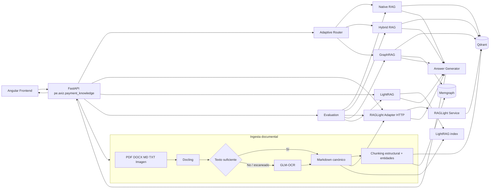

# Adaptive RAG & GraphRAG para Payment Knowledge

Esta PoC prueba una arquitectura de conocimiento documental para payment processing. El objetivo no es hacer otro chat con PDFs, sino comparar varias formas de recuperar información sobre el mismo corpus y poder ver por qué una estrategia funciona mejor que otra según el tipo de pregunta.

La aplicación procesa documentos con Docling, usa GLM-OCR como ruta OCR cuando el contenido viene escaneado o la extracción normal no alcanza un mínimo de texto, construye una representación vectorial en Qdrant y un grafo de conocimiento en Memgraph, y expone cinco estrategias de recuperación: Native RAG, Hybrid RAG, RAGLight, GraphRAG y LightRAG. En modo `auto`, un router decide entre recuperación semántica, híbrida o GraphRAG según señales observables de la consulta. RAGLight corre en un servicio Python separado para aislar su árbol de dependencias del backend principal y poder mantener Docling y RAGLight en versiones actuales sin forzar paquetes incompatibles en el mismo entorno.

La interfaz está hecha en Angular tomando como base visual el proyecto de ejemplo: navegación a la izquierda, conversación al centro y configuración/evaluación a la derecha. La adapté para carga documental, selección de estrategia, evidencia recuperada, trazabilidad técnica, evaluación y exploración del grafo.

## Qué quiero demostrar con esta PoC

El caso funcional está centrado en soporte técnico y operativo de pagos. El corpus de ejemplo incluye autorización ISO 8583, códigos de rechazo, conciliación, idempotencia, tokenización y controles PCI. Algunas preguntas se resuelven mejor por similitud semántica, otras necesitan conservar términos exactos como `05` o `ISO 8583`, y otras requieren relacionar conceptos como autorización, adquirente y conciliación.

La PoC permite probar estos caminos sobre el mismo conjunto de documentos:

| Estrategia | Qué implementa | Cuándo aporta más |
| --- | --- | --- |
| Native RAG | embedding denso + búsqueda vectorial en Qdrant | preguntas semánticas |
| Hybrid RAG | ranking vectorial + ranking lexical + Reciprocal Rank Fusion | códigos, términos exactos y consultas mixtas |
| RAGLight | flujo alterno con RAGLight, Qdrant y búsqueda híbrida BM25 + semántica + RRF | comparar implementación propia contra framework |
| GraphRAG | búsqueda híbrida + entidades/relaciones y expansión de un salto en Memgraph | relaciones, dependencias y flujo de componentes |
| LightRAG | flujo graph-RAG alternativo usando LightRAG SDK | comparar otra estrategia basada en grafo |
| Adaptive Routing | reglas explícitas sobre señales de la pregunta | seleccionar estrategia sin que el cliente conozca la implementación |

La comparación no pretende declarar un ganador universal. El endpoint de evaluación mide `Hit Rate`, `MRR` y latencia de retrieval contra un pequeño set controlado incluido en `datasets/evaluation/questions.json`.

## Tecnologías y versiones

Las versiones principales están fijadas para evitar cambios sorpresivos. Docling y RAGLight se ejecutan en procesos Python distintos porque sus dependencias de CLI no son compatibles entre sí en las versiones seleccionadas: Docling 2.130.0 termina requiriendo `typer>=0.19,<0.27`, mientras RAGLight 3.4.7 fija `typer==0.16.0`. En vez de degradar una de las dos tecnologías, la PoC las aísla y las conecta por HTTP.

| Componente | Versión usada |
| --- | ---: |
| Python | 3.12+ y < 3.14 |
| FastAPI | 0.141.1 |
| Uvicorn | 0.54.0 |
| Pydantic | 2.13.5 |
| Pydantic Settings | 2.15.0 |
| Docling | 2.130.0 |
| GLM-OCR SDK | 0.1.5 |
| Qdrant Server | 1.19.1 |
| qdrant-client | 1.19.1 |
| Memgraph | 3.13.1 |
| Neo4j Python Driver | 6.3.1, usado solo como cliente Bolt para Memgraph |
| RAGLight | 3.4.7 |
| LightRAG | 1.5.7 |
| Angular | 21.2.24 |
| TypeScript | 5.9.3 |
| Node para frontend | 22.x |
| Docker backend | `python:3.12-slim-bookworm` |
| Docker RAGLight | `python:3.12-slim-bookworm` |
| Docker frontend build | `node:22-bookworm-slim` |

El backend, procesamiento, retrieval, evaluación y scripts están escritos en Python. La única excepción es `frontend/`, porque Angular se implementa con TypeScript/HTML/CSS.

## Arquitectura



Qdrant y Memgraph son los únicos componentes persistentes de infraestructura. Docker Compose también levanta el backend, el servicio aislado de RAGLight, el frontend y un contenedor de bootstrap que carga el dataset de ejemplo y termina cuando la ingesta concluye. No agregué PostgreSQL, Kafka, MongoDB, KurrentDB, InfluxDB ni Drools porque no aportan a la prueba técnica.

El servicio RAGLight no agrega una nueva base ni duplica infraestructura. Sigue usando Qdrant, pero tiene su propio runtime Python. Esa separación existe por compatibilidad de dependencias y también deja claro el límite entre el framework RAGLight y el backend de la PoC.

## Cómo funciona la ingesta

1. El archivo entra por `POST /api/v1/documents/ingest` o por la carga del dataset.
2. Para `.md` y `.txt` se conserva el contenido directamente.
3. Para PDF, DOCX y otros formatos soportados se usa Docling y se exporta a Markdown.
4. Si el archivo es una imagen o el texto extraído queda debajo de `OCR_MIN_TEXT_CHARS`, se deriva a GLM-OCR.
5. El documento normalizado se guarda temporalmente como Markdown canónico dentro de `.runtime/canonical`.
6. `SemanticChunker` agrupa bloques conservando estructura y un solape controlado.
7. `PaymentEntityExtractor` detecta conceptos de pagos y códigos que sirven para el grafo.
8. Los chunks se indexan en Qdrant.
9. Documentos, chunks, entidades y relaciones de co-ocurrencia se materializan en Memgraph.
10. El backend envía la ruta del documento canónico al servicio `raglight-service`; ambos comparten el volumen `.runtime`, por lo que RAGLight indexa exactamente el mismo contenido normalizado.
11. Si LightRAG está configurado con un proveedor OpenAI-compatible, el contenido también se inserta en su índice.

El identificador de cada chunk es un UUID determinista para que Qdrant acepte el punto y para que reingestar el mismo contenido no cree identificadores distintos. Las relaciones `CO_OCCURS` de Memgraph también incluyen el `chunk_id`, de modo que una segunda carga no infla artificialmente los pesos.

## Estrategias de retrieval

### Native RAG

`NativeRagRetriever` genera el embedding de la pregunta y consulta la colección principal de Qdrant por similitud coseno. Es el camino más directo y sirve como baseline semántico.

### Hybrid RAG

`HybridRagRetriever` combina dos rankings independientes:

- dense retrieval en Qdrant;
- ranking lexical calculado sobre los chunks indexados;
- Reciprocal Rank Fusion para mezclar ambas listas sin depender de que los scores estén en la misma escala.

La intención es que consultas como `código 05` no pierdan el identificador exacto por depender solo del embedding.

### RAGLight

`RagLightAdapter` ya no importa el paquete RAGLight dentro del backend. Consume por HTTP un servicio Python independiente definido en `raglight_service/`. Ese servicio carga RAGLight 3.4.7, usa una colección Qdrant propia, embeddings Hugging Face y `SEARCH_HYBRID`. El framework combina BM25 + búsqueda semántica + RRF.

La separación es intencional. Docling 2.130.0 y RAGLight 3.4.7 no pueden convivir hoy en el mismo environment por el pin incompatible de `typer`. Mantenerlos en contenedores y entornos Conda distintos permite conservar las dos versiones sin `--no-deps`, sin forzar un `typer` incorrecto y sin degradar Docling.

RAGLight se usa como motor de retrieval alternativo y la generación sigue en la capa común. Así puedo comparar `Native/Hybrid implementado por nosotros` contra `Hybrid provisto por RAGLight` sin mezclar diferencias del modelo generativo.

### GraphRAG

`GraphRagRetriever` fusiona dos fuentes:

- retrieval híbrido desde Qdrant;
- evidencia estructurada desde Memgraph.

En Memgraph se crean nodos `Document`, `Chunk` y `Entity`. Los chunks apuntan a las entidades mediante `MENTIONS`; cuando dos entidades aparecen en el mismo chunk se materializa `CO_OCCURS`. La búsqueda toma entidades semilla detectadas en la pregunta y expande un salto hacia entidades relacionadas y chunks conectados. Luego fusiona ese resultado con Hybrid RAG.

No estoy usando Neo4j como servidor. La dependencia `neo4j` del `pyproject.toml` es el driver Bolt de Python que se conecta a Memgraph.

### LightRAG

`LightRagAdapter` integra `lightrag-hku` como flujo alterno. Para construir entidades, relaciones y embeddings necesita un LLM y un endpoint de embeddings. La configuración usa una API OpenAI-compatible para no amarrar la PoC a un único proveedor.

Con `LIGHTRAG_ENABLED=true` y las variables `OPENAI_*` configuradas, la ingesta inserta el documento en LightRAG y las consultas usan `QueryParam(mode="hybrid", only_need_context=True)`. La capa común se encarga después de generar la respuesta final.

### Adaptive Routing

El router es intencionalmente explicable:

- términos de relaciones o flujo como `relación`, `componentes`, `entre`, `depende` -> `graphrag`;
- códigos o identificadores exactos como `05`, `51`, `91`, `ISO 8583`, `PAY-*`, `RC-*` -> `hybrid_rag`;
- el resto -> `native_rag`.

RAGLight y LightRAG quedan disponibles como estrategias manuales y dentro de la evaluación. De esta forma el modo `auto` no depende de que haya credenciales externas para funcionar.

## Generación de respuesta

Por defecto `LLM_PROVIDER=extractive`. La aplicación devuelve extractos de la evidencia recuperada y no necesita un LLM externo para probar retrieval, routing, Qdrant y Memgraph.

Si se quiere síntesis generativa:

```env
LLM_PROVIDER=openai
OPENAI_API_KEY=...
OPENAI_BASE_URL=https://api.openai.com/v1
OPENAI_MODEL=gpt-5-mini
```

`OPENAI_BASE_URL` también puede apuntar a un servidor local compatible con OpenAI. Para LightRAG se usan además:

```env
OPENAI_EMBEDDING_MODEL=text-embedding-3-small
OPENAI_EMBEDDING_DIMENSION=1536
LIGHTRAG_ENABLED=true
```

Si el endpoint local requiere un token aunque no lo valide, se puede colocar un valor no vacío en `OPENAI_API_KEY`.

## GLM-OCR

El modo por defecto usa MaaS:

```env
GLM_OCR_MODE=maas
ZHIPU_API_KEY=...
```

También queda preparado para un endpoint self-hosted:

```env
GLM_OCR_MODE=selfhosted
GLM_OCR_API_URL=http://localhost:5002/v1/chat/completions
ZHIPU_API_KEY=
```

Los documentos digitales que Docling procesa correctamente no necesitan GLM-OCR. El OCR solo entra cuando corresponde, para evitar costo y latencia innecesarios.

## Estructura del proyecto

```text
.
├── backend/
│   ├── Dockerfile             imagen Python directa, sin Conda
│   ├── src/pe/axiz/payment_knowledge/
│   │   ├── api/              endpoints FastAPI
│   │   ├── application/      orquestación de ingesta, consulta y evaluación
│   │   ├── domain/           contratos y modelos Pydantic
│   │   ├── generation/       respuesta extractiva u OpenAI-compatible
│   │   ├── infrastructure/   Docling, GLM-OCR, Qdrant, Memgraph y embeddings
│   │   └── retrieval/        Native, Hybrid, GraphRAG, LightRAG, adapter RAGLight y router
│   └── tests/                pruebas unitarias del backend
├── raglight_service/
│   ├── Dockerfile             runtime Python aislado de RAGLight
│   ├── environment.yml       entorno Conda local exclusivo de RAGLight
│   ├── pyproject.toml        dependencias del servicio RAGLight
│   ├── src/pe/axiz/raglight_service/
│   │   └── main.py           API interna de indexación y búsqueda
│   └── tests/                pruebas del servicio aislado
├── datasets/
│   ├── sample_documents/     corpus de payment processing
│   ├── evaluation/           preguntas y fuentes esperadas
│   └── seed.py               carga del dataset usando la API
├── scripts/
│   └── verify.py             validaciones reproducibles
├── frontend/                 Angular, basado visualmente en la interfaz de referencia
│   ├── Dockerfile             build con imagen oficial de Node, sin Conda
│   └── proxy.conf.json       proxy local /api hacia FastAPI
├── infrastructure/
│   ├── docker-compose.yml    stack completo: stores, RAGLight, API, seed y frontend
│   ├── requests/             payloads de ejemplo
│   └── responses/            respuestas de referencia de la API
├── .env.example
├── environment.yml          entorno Conda local del backend + frontend
├── pyproject.toml           dependencias del backend principal
└── README.md
```

Toda la explicación del proyecto está en este README. No hay documentación duplicada en otras carpetas.

## Código principal

Los puntos que conviene revisar primero son:

| Archivo | Responsabilidad |
| --- | --- |
| `backend/src/pe/axiz/payment_knowledge/main.py` | crea FastAPI y CORS |
| `container.py` | arma las dependencias y los cinco motores |
| `application/services.py` | coordina ingesta, query y evaluación |
| `infrastructure/document_processing.py` | Docling, GLM-OCR, chunking y entidades |
| `infrastructure/qdrant_store.py` | persistencia y consulta vectorial |
| `infrastructure/memgraph_store.py` | nodos, relaciones, expansión y exploración del grafo |
| `retrieval/native.py` | Native RAG e Hybrid RAG con RRF |
| `retrieval/raglight_adapter.py` | cliente HTTP hacia el servicio RAGLight aislado |
| `retrieval/graphrag.py` | fusión de evidencia híbrida y grafo |
| `retrieval/lightrag_adapter.py` | integración con LightRAG |
| `retrieval/router.py` | decisión del modo `auto` |
| `generation/llm.py` | generación común para que los motores se comparen con la misma salida |
| `raglight_service/src/pe/axiz/raglight_service/main.py` | RAGLight, búsqueda híbrida y colección Qdrant dedicada |
| `frontend/src/app/app.ts` | interacción de la UI con la API |
| `frontend/src/app/app.html` | layout de conversación, configuración, métricas y grafo |

## Endpoints en orden de uso

| Orden | Método y endpoint | Uso funcional | Qué hace técnicamente |
| ---: | --- | --- | --- |
| 1 | `GET /api/v1/health` | verificar que la PoC está lista | prueba conectividad con Qdrant y Memgraph e informa disponibilidad de RAGLight/LightRAG |
| 2 | `POST /api/v1/datasets/seed` | cargar el dataset de ejemplo | recorre `datasets/sample_documents`, procesa, fragmenta e indexa en los motores habilitados |
| 2b | `POST /api/v1/documents/ingest` | cargar un documento propio | multipart upload -> Docling/GLM-OCR -> chunks -> Qdrant/Memgraph/RAGLight/LightRAG |
| 3 | `POST /api/v1/query` | consultar conocimiento | ejecuta estrategia solicitada o router `auto`, recupera evidencia y genera respuesta |
| 4 | `GET /api/v1/graph/neighborhood/{entity}` | revisar relaciones | consulta relaciones `CO_OCCURS` en Memgraph |
| 5 | `POST /api/v1/evaluations/run` | comparar motores | ejecuta retrieval contra el set de evaluación y calcula Hit Rate, MRR y latencia |
| - | `GET /docs` | probar API desde navegador | Swagger generado por FastAPI |

Los JSON usados en los ejemplos están en `infrastructure/requests` y `infrastructure/responses`.

El servicio RAGLight expone tres endpoints internos. El frontend no los consume directamente; el backend actúa como fachada.

| Método y endpoint | Uso técnico |
| --- | --- |
| `GET http://raglight-service:8010/health` | comprobar que el proceso HTTP está disponible |
| `POST http://raglight-service:8010/index` | indexar un Markdown canónico compartido por volumen |
| `POST http://raglight-service:8010/search` | ejecutar retrieval híbrido RAGLight y devolver evidencia al backend |

## Requisitos

Hay dos formas de ejecutar la PoC. La recomendada es Docker porque deja listo el stack completo y también precarga el dataset. Conda queda como alternativa para desarrollo local.

Para Docker solo necesito:

- Docker Engine o Docker Desktop con Compose v2;
- 6 GB de RAM libres como punto de partida. Docling y los modelos locales pueden pedir más durante la primera ejecución.

Para desarrollo local necesito además una distribución Conda, por ejemplo Miniconda o Miniforge. No uso `venv` y no hay pasos manuales de `pip install`. Python y Node salen del entorno Conda.

El flujo base no necesita credenciales. Solo hacen falta cuando quiero usar:

- GLM-OCR MaaS sobre documentos escaneados;
- LightRAG, porque necesita LLM y embeddings para construir su grafo;
- síntesis generativa con `LLM_PROVIDER=openai`.

## Ejecución recomendada: todo con Docker

Desde la raíz del proyecto:

```bash
docker compose -f infrastructure/docker-compose.yml up --build
```

Ese único comando hace el bootstrap completo:

1. levanta Qdrant;
2. levanta Memgraph;
3. construye y levanta `raglight-service` con Python 3.12 y RAGLight 3.4.7;
4. construye y levanta el backend principal con Python 3.12, Docling, GLM-OCR y LightRAG;
5. ejecuta `dataset-seed` como contenedor de una sola corrida usando la misma definición de build del backend;
6. `dataset-seed` espera a que la ruta de ingesta esté disponible y llama a `POST /api/v1/datasets/seed`;
7. se crean chunks, vectores, nodos, relaciones y el índice RAGLight;
8. cuando el seed termina correctamente, levanta el frontend Angular.

No hay que ejecutar inserts ni scripts de carga después. `dataset-seed` termina con código `0` cuando la precarga finaliza; eso es esperado.

### Por qué backend y RAGLight se construyen por separado

El error `ResolutionImpossible` que aparece al intentar instalar todo junto no se resuelve forzando pip. Docling 2.130.0 depende de un rango de Typer que empieza en 0.19, mientras RAGLight 3.4.7 fija Typer 0.16.0. Por eso el Compose usa dos imágenes Python distintas. El backend no instala `raglight`; `raglight-service` no instala Docling. Los dos comparten Qdrant y el volumen `.runtime`.

`dataset-seed` declara el mismo `image` y el mismo `build` que `backend` mediante un ancla YAML. Así Compose sabe construir la imagen local y no necesita buscar `axiz-adaptive-rag-backend:local` en Docker Hub. No hace falta `docker login`.

Dentro de Docker no uso Conda ni Micromamba. Los servicios Python parten de `python:3.12-slim-bookworm` y se instalan directamente con `python -m pip install .`. El frontend se construye con `node:22-bookworm-slim` y luego se sirve desde Nginx. Conda queda reservado para desarrollo local desde el IDE.

Servicios expuestos:

| Servicio | URL / puerto | Uso |
| --- | --- | --- |
| Frontend | `http://localhost:4200` | interfaz Angular |
| API | `http://localhost:8000` | FastAPI principal |
| RAGLight service | `http://localhost:8010` | API interna de retrieval RAGLight; expuesta para diagnóstico local |
| Swagger | `http://localhost:8000/docs` | prueba de endpoints |
| Qdrant HTTP | `localhost:6333` | vectores y colecciones |
| Qdrant gRPC | `localhost:6334` | interfaz gRPC |
| Memgraph Bolt | `localhost:7687` | acceso al grafo |
| Memgraph | `localhost:7444` | puerto expuesto por Memgraph |

Para revisar el estado en otra terminal:

```bash
docker compose -f infrastructure/docker-compose.yml ps
```

Para detener el stack se usa `Ctrl+C`. Si luego quiero remover los contenedores sin borrar los datos:

```bash
docker compose -f infrastructure/docker-compose.yml down
```

Para resetear completamente la PoC, incluidas las colecciones, el grafo y el runtime de LightRAG:

```bash
docker compose -f infrastructure/docker-compose.yml down -v
```

No configuré health checks periódicos en Compose. El bootstrap usa reintentos finitos solo hasta que el dataset logra cargarse, así que no hay llamadas de health ejecutándose permanentemente ni ensuciando los logs.

### Configuración del `.env` y credenciales

La PoC base puede levantar sin credenciales externas. En ese modo funcionan Docling para documentos digitales, Native RAG, Hybrid RAG, RAGLight, GraphRAG, Adaptive Routing, Qdrant, Memgraph, evaluación y el frontend. La generación queda en modo extractivo.

Creo el archivo desde la raíz solo cuando quiero activar las capacidades que dependen de servicios externos:

```bash
cp .env.example .env
```

Para Docker, Compose usa las variables del `.env` ubicado en la raíz. Las direcciones internas de Qdrant y Memgraph ya están definidas en `infrastructure/docker-compose.yml`, por eso no tengo que cambiar sus URLs para ejecutar el stack completo.

| Variable | ¿Obligatoria? | Para qué sirve | De dónde sale |
| --- | --- | --- | --- |
| `LLM_PROVIDER` | No | `extractive` no llama a ningún LLM; `openai` activa síntesis generativa | valor de configuración |
| `OPENAI_API_KEY` | Solo para generación OpenAI y LightRAG con este adapter | autenticación del LLM y embeddings usados por LightRAG | colocar la clave del proveedor configurado |
| `OPENAI_BASE_URL` | Solo si cambio de endpoint | endpoint OpenAI-compatible | URL del proveedor; el ejemplo deja el endpoint estándar |
| `OPENAI_MODEL` | Solo con `LLM_PROVIDER=openai` o LightRAG | modelo generativo | nombre soportado por el proveedor |
| `OPENAI_EMBEDDING_MODEL` | Para LightRAG | embeddings de LightRAG | nombre soportado por el proveedor |
| `OPENAI_EMBEDDING_DIMENSION` | Para LightRAG | dimensión que debe coincidir con el embedding elegido | documentación del modelo de embeddings |
| `ZHIPU_API_KEY` | Solo para GLM-OCR en modo MaaS | autenticación contra el servicio GLM-OCR de Zhipu/Z.ai | consola BigModel: `https://www.bigmodel.cn/usercenter/proj-mgmt/apikeys` |
| `GLM_OCR_MODE` | Solo si quiero cambiar el modo | `maas` usa la nube; `selfhosted` usa un endpoint propio | `maas` o `selfhosted` |
| `GLM_OCR_API_URL` | No en MaaS | URL del servidor GLM-OCR self-hosted/OpenAI-compatible | URL de mi despliegue propio |
| `RAGLIGHT_ENABLED` | No | habilita el flujo RAGLight | `true`/`false`; no necesita token |
| `RAGLIGHT_SERVICE_URL` | No | URL del servicio aislado RAGLight | local: `http://localhost:8010`; Docker la sobrescribe a `http://raglight-service:8010` |
| `RAGLIGHT_TIMEOUT_SECONDS` | No | timeout de indexación/búsqueda RAGLight | `600` por defecto |
| `LIGHTRAG_ENABLED` | No | habilita el flujo LightRAG | `true`/`false`; además necesita LLM + embeddings |
| `QDRANT_*` | No para Docker | colección y conexión vectorial | la PoC levanta Qdrant local |
| `MEMGRAPH_*` | No para Docker | conexión al grafo | la PoC levanta Memgraph local sin usuario/password |
| `EMBEDDING_*` | No | embeddings usados por Native/Hybrid/RAGLight | modelo público configurado; no necesita token |

Docling no requiere API key. RAGLight tampoco requiere API key en esta PoC porque usa embeddings públicos/Hugging Face y Qdrant local. Qdrant y Memgraph tampoco necesitan tokens con la configuración del Compose.

GLM-OCR solo necesita `ZHIPU_API_KEY` cuando el documento cae en la ruta OCR y `GLM_OCR_MODE=maas`. Los `.md` del dataset inicial no usan OCR, por eso el bootstrap puede terminar sin esa clave.

LightRAG es distinto: para construir su grafo necesita un LLM y embeddings. El adapter incluido usa un endpoint OpenAI-compatible, por lo que si dejo `OPENAI_API_KEY` vacío, LightRAG queda reportado como no disponible pero no bloquea Native RAG, Hybrid RAG, RAGLight ni GraphRAG.

### Ejemplo mínimo sin tokens

```env
LLM_PROVIDER=extractive
RAGLIGHT_ENABLED=true
LIGHTRAG_ENABLED=true
GLM_OCR_MODE=maas
ZHIPU_API_KEY=
OPENAI_API_KEY=
```

Con esta configuración el stack levanta y precarga el dataset textual. LightRAG queda inactivo hasta que tenga credenciales, y GLM-OCR solo fallaría si intento cargar un documento que realmente necesite OCR.

### Ejemplo con todas las rutas cloud habilitadas

```env
LLM_PROVIDER=openai
OPENAI_API_KEY=sk-ejemplo-reemplazar
OPENAI_BASE_URL=https://api.openai.com/v1
OPENAI_MODEL=gpt-5-mini
OPENAI_EMBEDDING_MODEL=text-embedding-3-small
OPENAI_EMBEDDING_DIMENSION=1536

GLM_OCR_MODE=maas
GLM_OCR_API_URL=
ZHIPU_API_KEY=sk-zhipu-ejemplo-reemplazar

RAGLIGHT_ENABLED=true
LIGHTRAG_ENABLED=true
```

Los valores con `ejemplo-reemplazar` son solo placeholders. No se deben commitear claves reales; `.env` está ignorado por Git.

### Ejemplo de GLM-OCR self-hosted

Si ya tengo un servidor GLM-OCR propio con API OpenAI-compatible:

```env
GLM_OCR_MODE=selfhosted
GLM_OCR_API_URL=http://localhost:5002/v1/chat/completions
ZHIPU_API_KEY=
```

En Docker, `localhost` dentro del backend apunta al mismo contenedor. Si el OCR self-hosted corre fuera del stack, debo usar un hostname accesible desde la red Docker o incorporarlo como otro servicio explícito.

## Ejecución local con Conda

Esta ruta sirve cuando quiero depurar desde el IDE. Como Docling y RAGLight tienen un conflicto real de `typer`, uso dos environments Conda separados. No creo `.venv` y no hago instalaciones manuales fuera de los archivos `environment.yml`.

### 1. Crear el entorno principal

Desde la raíz:

```bash
conda env create -f environment.yml
```

Si ya existe:

```bash
conda env update -n axiz-adaptive-rag-payments -f environment.yml --prune
```

Este entorno contiene backend, Docling, GLM-OCR, LightRAG y Node 22 para Angular.

### 2. Crear el entorno RAGLight

```bash
conda env create -f raglight_service/environment.yml
```

Si ya existe:

```bash
conda env update -n axiz-raglight-service -f raglight_service/environment.yml --prune
```

Este segundo environment contiene RAGLight 3.4.7 y su propio árbol de dependencias.

### 3. Levantar solo la infraestructura persistente

En una terminal:

```bash
docker compose -f infrastructure/docker-compose.yml up qdrant memgraph
```

### 4. Ejecutar RAGLight con Conda

En otra terminal, desde la raíz:

```bash
conda run -n axiz-raglight-service python -m uvicorn pe.axiz.raglight_service.main:app --host 0.0.0.0 --port 8010
```

### 5. Ejecutar backend con Conda

En otra terminal:

```bash
conda run -n axiz-adaptive-rag-payments python -m uvicorn pe.axiz.payment_knowledge.main:app --host 0.0.0.0 --port 8000
```

La configuración local por defecto usa `RAGLIGHT_SERVICE_URL=http://localhost:8010`.

### 6. Precargar el dataset con Conda

Con backend y RAGLight arriba:

```bash
conda run -n axiz-adaptive-rag-payments python datasets/seed.py --wait-seconds 900
```

Al terminar deberían existir:

- colección principal `axiz_payment_chunks` en Qdrant;
- colección `axiz_payment_raglight`;
- nodos `Document`, `Chunk` y `Entity` en Memgraph;
- relaciones `CONTAINS`, `MENTIONS` y `CO_OCCURS`;
- working directory de LightRAG si está configurado.

### 7. Ejecutar Angular con Conda

Primero instalo los paquetes npm usando Node del entorno Conda principal:

```bash
conda run -n axiz-adaptive-rag-payments npm --prefix frontend install --no-audit --no-fund
```

Luego:

```bash
conda run -n axiz-adaptive-rag-payments npm --prefix frontend start
```

Abrir `http://localhost:4200`. En desarrollo Angular usa `frontend/proxy.conf.json`; en Docker Nginx hace el mismo proxy. El frontend consume `/api/v1` y no tiene `http://localhost:8000` hardcodeado.

La interfaz permite:

- precargar nuevamente el dataset;
- subir documentos;
- elegir `auto`, Native RAG, Hybrid RAG, RAGLight, GraphRAG o LightRAG;
- cambiar `top_k`;
- mostrar u ocultar trazabilidad y evidencia;
- ejecutar evaluación de los cinco motores;
- consultar relaciones de Memgraph desde el panel derecho.

Para generar el build Angular desde Conda:

```bash
conda run -n axiz-adaptive-rag-payments npm --prefix frontend run build
```

## Qué se inserta automáticamente al levantar Docker

El servicio `dataset-seed` usa `datasets/seed.py` y espera hasta 900 segundos por el backend. No usa un health check infinito: intenta la carga, espera tres segundos si la infraestructura todavía no está lista y termina apenas recibe una respuesta exitosa.

La carga recorre `datasets/sample_documents` y ejecuta el mismo pipeline que una carga manual:

```text
documento
  -> Docling / GLM-OCR si corresponde
  -> Markdown canónico
  -> chunking + entidades
  -> Qdrant
  -> Memgraph
  -> RAGLight
  -> LightRAG cuando está configurado
```

Qdrant usa IDs deterministas para los chunks y Memgraph usa `MERGE`, por lo que volver a cargar el corpus no crea copias nuevas de esos elementos base.

## Pruebas con curl

### Prueba 1: salud

```bash
curl http://localhost:8000/api/v1/health
```

Sirve para separar un problema de la API de un problema de Qdrant o Memgraph. El estado `ok` requiere ambos stores disponibles. `lightrag=false` es esperable si no se configuró un proveedor OpenAI-compatible.

### Prueba 2: cargar dataset

```bash
curl -X POST http://localhost:8000/api/v1/datasets/seed
```

Procesa los cuatro documentos de ejemplo. Esta llamada prueba la ruta completa de ingesta: parsing, chunking, embeddings, Qdrant, Memgraph y los adapters alternos habilitados.

### Prueba 3: Native RAG

```bash
curl -X POST http://localhost:8000/api/v1/query \
  -H "Content-Type: application/json" \
  -d '{
    "question":"¿Cómo evita la idempotencia cobros duplicados cuando hay timeout?",
    "strategy":"native_rag",
    "top_k":5,
    "include_trace":true,
    "include_evidence":true
  }'
```

Prueba el baseline vectorial puro.

### Prueba 4: Hybrid RAG con código exacto

```bash
curl -X POST http://localhost:8000/api/v1/query \
  -H "Content-Type: application/json" \
  --data-binary @infrastructure/requests/query-hybrid.json
```

Está pensada para comprobar que una consulta con códigos ISO 8583 aprovecha el ranking lexical además del vectorial.

### Prueba 5: Adaptive Routing

```bash
curl -X POST http://localhost:8000/api/v1/query \
  -H "Content-Type: application/json" \
  --data-binary @infrastructure/requests/query-auto.json
```

La pregunta incluida habla de componentes relacionados entre autorización y conciliación, por lo que el trace debería mostrar `reason=relaciones` y ejecutar `graphrag`.

### Prueba 6: RAGLight

```bash
curl -X POST http://localhost:8000/api/v1/query \
  -H "Content-Type: application/json" \
  -d '{
    "question":"¿Qué significa el código 05 en una autorización?",
    "strategy":"raglight",
    "top_k":5,
    "include_trace":true,
    "include_evidence":true
  }'
```

Fuerza el camino alterno RAGLight sobre su colección Qdrant. Esto permite compararlo con `hybrid_rag` usando la misma pregunta.

### Prueba 7: GraphRAG

```bash
curl -X POST http://localhost:8000/api/v1/query \
  -H "Content-Type: application/json" \
  -d '{
    "question":"¿Qué componentes están relacionados entre autorización y conciliación?",
    "strategy":"graphrag",
    "top_k":5,
    "include_trace":true,
    "include_evidence":true
  }'
```

Fuerza la fusión entre evidencia de Memgraph e Hybrid RAG.

### Prueba 8: explorar Memgraph

```bash
curl "http://localhost:8000/api/v1/graph/neighborhood/AUTORIZACION"
```

Devuelve las entidades que comparten chunks con la entidad consultada y el peso basado en cantidad de chunks compartidos.

### Prueba 9: LightRAG

Con `OPENAI_API_KEY`, `OPENAI_BASE_URL`, `OPENAI_MODEL`, `OPENAI_EMBEDDING_MODEL` y dimensión configurados:

```bash
curl -X POST http://localhost:8000/api/v1/query \
  -H "Content-Type: application/json" \
  -d '{
    "question":"Relaciona autorización, adquirente y conciliación",
    "strategy":"lightrag",
    "top_k":5,
    "include_trace":true,
    "include_evidence":true
  }'
```

Sin proveedor configurado devuelve un error controlado indicando que LightRAG necesita esa configuración.

### Prueba 10: evaluación

```bash
curl -X POST http://localhost:8000/api/v1/evaluations/run \
  -H "Content-Type: application/json" \
  --data-binary @infrastructure/requests/evaluation.json
```

Ejecuta el mismo set contra Native RAG, Hybrid RAG, RAGLight, GraphRAG y LightRAG. Si un motor no está disponible, la corrida no se corta: sus casos quedan con `success=false` y la suma aparece en `failed_cases`.

## Probar GLM-OCR

El dataset incluido es textual para que la PoC funcione sin claves externas. Para probar OCR, usar un PDF escaneado o una imagen:

```bash
curl -X POST http://localhost:8000/api/v1/documents/ingest \
  -F "file=@./mi-documento-escaneado.pdf"
```

En MaaS debe estar definido `ZHIPU_API_KEY`. La respuesta de ingesta indica `ocr_used=true` cuando entró la ruta GLM-OCR.

## Evaluación incluida

`datasets/evaluation/questions.json` define preguntas y fuentes esperadas. La evaluación está centrada en retrieval, no en calidad estilística del LLM. Por eso calcula:

- `hit_rate`: si alguna fuente esperada aparece en Top K;
- `mrr`: qué tan arriba aparece la primera fuente esperada;
- `avg_latency_ms`: tiempo promedio del retrieval;
- `successful_cases` y `failed_cases`: permite comparar sin ocultar que un motor estaba deshabilitado o mal configurado.

Para una evaluación más seria se puede ampliar el dataset sin cambiar el código del servicio.

## Pruebas de código

Todas las pruebas locales se ejecutan dentro del entorno Conda.

Backend completo:

```bash
conda run -n axiz-adaptive-rag-payments python scripts/verify.py
```

Pruebas unitarias del backend:

```bash
conda run -n axiz-adaptive-rag-payments python -m pytest -q backend/tests
```

Pruebas del servicio RAGLight:

```bash
conda run -n axiz-raglight-service python -m pytest -q raglight_service/tests
```

Chequeo de estilo:

```bash
conda run -n axiz-adaptive-rag-payments ruff check backend/src backend/tests datasets
conda run -n axiz-raglight-service ruff check raglight_service/src raglight_service/tests
```

Frontend:

```bash
conda run -n axiz-adaptive-rag-payments npm --prefix frontend run build
```

## Estado de validación de esta entrega

Antes de empaquetar esta versión validé:

- `compileall` del backend, dataset y servicio RAGLight;
- `8 passed` en `backend/tests`;
- `2 passed` en `raglight_service/tests`;
- construcción del wheel del backend sin instalar dependencias;
- construcción del wheel del servicio RAGLight sin instalar dependencias;
- sintaxis YAML de `environment.yml`, `raglight_service/environment.yml` e `infrastructure/docker-compose.yml`;
- que `backend` y `dataset-seed` resuelvan al mismo `image` + `build`;
- que el `pyproject.toml` del backend principal ya no contenga `raglight`.

El entorno usado para preparar el ZIP no tiene Docker ni Conda y tampoco tiene salida de red desde `pip`, así que no registro una ejecución de `docker compose up --build` ni una resolución online completa que no pude hacer. El conflicto concreto de la ejecución anterior queda eliminado por diseño: Docling y RAGLight ya no comparten el mismo environment Python.

## Decisiones de alcance

- Qdrant y Memgraph son los únicos contenedores de infraestructura porque son los únicos necesarios para este caso.
- RAGLight reutiliza Qdrant pero corre en un servicio Python separado y usa una colección distinta para que la comparación no mezcle índices ni árboles de dependencias.
- GraphRAG es una implementación propia sobre Memgraph y Hybrid RAG; LightRAG se mantiene como flujo alterno para comparación.
- La generación se desacopla del retrieval. Esto permite medir retrieval sin que una respuesta de LLM cambie el resultado de Hit Rate o MRR.
- El modo `auto` no selecciona RAGLight/LightRAG para evitar que el comportamiento base dependa de frameworks o credenciales externas. Esos motores se pueden forzar desde API/UI y se incluyen en evaluación.
- No se agregó un broker, una base relacional o una base documental porque no hay un requisito del caso que lo justifique.
