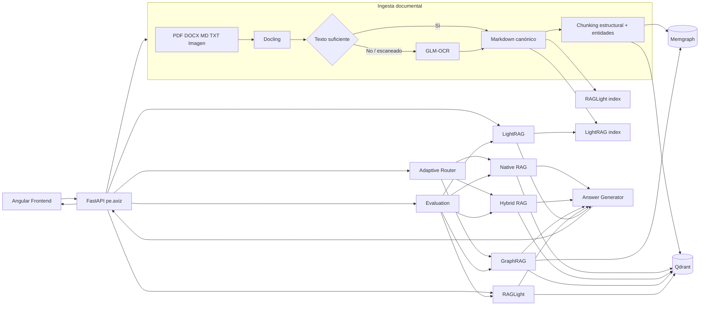

# Adaptive RAG & GraphRAG para Payment Knowledge

Esta PoC prueba una arquitectura de conocimiento documental para payment processing. El objetivo no es hacer otro chat con PDFs, sino comparar varias formas de recuperar información sobre el mismo corpus y poder ver por qué una estrategia funciona mejor que otra según el tipo de pregunta.

La aplicación procesa documentos con Docling, usa GLM-OCR como ruta OCR cuando el contenido viene escaneado o la extracción normal no alcanza un mínimo de texto, construye una representación vectorial en Qdrant y un grafo de conocimiento en Memgraph, y expone cinco estrategias de recuperación: Native RAG, Hybrid RAG, RAGLight, GraphRAG y LightRAG. En modo `auto`, un router decide entre recuperación semántica, híbrida o GraphRAG según señales observables de la consulta.

La interfaz está hecha en Angular tomando como base visual el proyecto de ejemplo: navegación a la izquierda, conversación al centro y configuración/evaluación a la derecha. La adapté para carga documental, selección de estrategia, evidencia recuperada, trazabilidad técnica, evaluación y exploración del grafo.

## Qué quiero demostrar con esta PoC

El caso funcional está centrado en soporte técnico y operativo de pagos. El corpus de ejemplo incluye autorización ISO 8583, códigos de rechazo, conciliación, idempotencia, tokenización y controles PCI. Algunas preguntas se resuelven mejor por similitud semántica, otras necesitan conservar términos exactos como `05` o `ISO 8583`, y otras requieren relacionar conceptos como autorización, adquirente y conciliación.

La PoC permite probar estos caminos sobre el mismo conjunto de documentos:

| Estrategia | Qué implementa | Cuándo aporta más |
| --- | --- | --- |
| Native RAG | embedding denso + búsqueda vectorial en Qdrant | preguntas semánticas |
| Hybrid RAG | ranking vectorial + ranking lexical + Reciprocal Rank Fusion | códigos, términos exactos y consultas mixtas |
| RAGLight | flujo alterno con RAGLight, Qdrant y búsqueda híbrida BM25 + semántica + RRF | comparar implementación propia contra framework |
| GraphRAG | búsqueda híbrida + entidades/relaciones y expansión de un salto en Memgraph | relaciones, dependencias y flujo de componentes |
| LightRAG | flujo graph-RAG alternativo usando LightRAG SDK | comparar otra estrategia basada en grafo |
| Adaptive Routing | reglas explícitas sobre señales de la pregunta | seleccionar estrategia sin que el cliente conozca la implementación |

La comparación no pretende declarar un ganador universal. El endpoint de evaluación mide `Hit Rate`, `MRR` y latencia de retrieval contra un pequeño set controlado incluido en `datasets/evaluation/questions.json`.

## Tecnologías y versiones

Las versiones están fijadas para que el proyecto no dependa de rangos abiertos. Se eligieron versiones actuales cuyos requisitos publicados son compatibles con Python 3.12/3.13; la resolución integral del árbol de dependencias debe confirmarse al instalar en un entorno con acceso a los repositorios de paquetes.

| Componente | Versión usada |
| --- | ---: |
| Python | 3.12+ y < 3.14 |
| FastAPI | 0.141.1 |
| Uvicorn | 0.54.0 |
| Pydantic | 2.13.5 |
| Pydantic Settings | 2.15.0 |
| Docling | 2.130.0 |
| GLM-OCR SDK | 0.1.5 |
| Qdrant Server | 1.19.1 |
| qdrant-client | 1.19.1 |
| Memgraph | 3.13.1 |
| Neo4j Python Driver | 6.3.1, usado solo como cliente Bolt para Memgraph |
| RAGLight | 3.4.7 |
| LightRAG | 1.5.7 |
| Angular | 21.2.24 |
| TypeScript | 5.9.3 |
| Node para frontend | 20.19+ o 22.x compatible; Dockerfile usa 22.22.3 |

El backend, procesamiento, retrieval, evaluación y scripts están escritos en Python. La única excepción es `frontend/`, porque Angular se implementa con TypeScript/HTML/CSS.

## Arquitectura



Solo se levantan Qdrant y Memgraph como infraestructura persistente. No agregué PostgreSQL, Kafka, MongoDB, KurrentDB, InfluxDB ni Drools porque no aportan a la prueba técnica y meterlos solo haría más pesada la PoC.

## Cómo funciona la ingesta

1. El archivo entra por `POST /api/v1/documents/ingest` o por la carga del dataset.
2. Para `.md` y `.txt` se conserva el contenido directamente.
3. Para PDF, DOCX y otros formatos soportados se usa Docling y se exporta a Markdown.
4. Si el archivo es una imagen o el texto extraído queda debajo de `OCR_MIN_TEXT_CHARS`, se deriva a GLM-OCR.
5. El documento normalizado se guarda temporalmente como Markdown canónico dentro de `.runtime/canonical`.
6. `SemanticChunker` agrupa bloques conservando estructura y un solape controlado.
7. `PaymentEntityExtractor` detecta conceptos de pagos y códigos que sirven para el grafo.
8. Los chunks se indexan en Qdrant.
9. Documentos, chunks, entidades y relaciones de co-ocurrencia se materializan en Memgraph.
10. El mismo documento canónico se envía al índice alterno de RAGLight.
11. Si LightRAG está configurado con un proveedor OpenAI-compatible, el contenido también se inserta en su índice.

El identificador de cada chunk es un UUID determinista para que Qdrant acepte el punto y para que reingestar el mismo contenido no cree identificadores distintos. Las relaciones `CO_OCCURS` de Memgraph también incluyen el `chunk_id`, de modo que una segunda carga no infla artificialmente los pesos.

## Estrategias de retrieval

### Native RAG

`NativeRagRetriever` genera el embedding de la pregunta y consulta la colección principal de Qdrant por similitud coseno. Es el camino más directo y sirve como baseline semántico.

### Hybrid RAG

`HybridRagRetriever` combina dos rankings independientes:

- dense retrieval en Qdrant;
- ranking lexical calculado sobre los chunks indexados;
- Reciprocal Rank Fusion para mezclar ambas listas sin depender de que los scores estén en la misma escala.

La intención es que consultas como `código 05` no pierdan el identificador exacto por depender solo del embedding.

### RAGLight

`RagLightAdapter` usa una colección Qdrant independiente. La configuración usa el Builder de RAGLight con embeddings Hugging Face y `SEARCH_HYBRID`. El framework combina BM25 + búsqueda semántica + RRF. No necesita un LLM para esta ruta porque la PoC usa RAGLight como motor de retrieval alternativo y mantiene la generación de respuesta en la capa común.

Eso permite comparar `Native/Hybrid implementado por nosotros` contra `Hybrid provisto por RAGLight` sin mezclar diferencias del modelo generativo.

### GraphRAG

`GraphRagRetriever` fusiona dos fuentes:

- retrieval híbrido desde Qdrant;
- evidencia estructurada desde Memgraph.

En Memgraph se crean nodos `Document`, `Chunk` y `Entity`. Los chunks apuntan a las entidades mediante `MENTIONS`; cuando dos entidades aparecen en el mismo chunk se materializa `CO_OCCURS`. La búsqueda toma entidades semilla detectadas en la pregunta y expande un salto hacia entidades relacionadas y chunks conectados. Luego fusiona ese resultado con Hybrid RAG.

No estoy usando Neo4j como servidor. La dependencia `neo4j` del `pyproject.toml` es el driver Bolt de Python que se conecta a Memgraph.

### LightRAG

`LightRagAdapter` integra `lightrag-hku` como flujo alterno. Para construir entidades, relaciones y embeddings necesita un LLM y un endpoint de embeddings. La configuración usa una API OpenAI-compatible para no amarrar la PoC a un único proveedor.

Con `LIGHTRAG_ENABLED=true` y las variables `OPENAI_*` configuradas, la ingesta inserta el documento en LightRAG y las consultas usan `QueryParam(mode="hybrid", only_need_context=True)`. La capa común se encarga después de generar la respuesta final.

### Adaptive Routing

El router es intencionalmente explicable:

- términos de relaciones o flujo como `relación`, `componentes`, `entre`, `depende` -> `graphrag`;
- códigos o identificadores exactos como `05`, `51`, `91`, `ISO 8583`, `PAY-*`, `RC-*` -> `hybrid_rag`;
- el resto -> `native_rag`.

RAGLight y LightRAG quedan disponibles como estrategias manuales y dentro de la evaluación. De esta forma el modo `auto` no depende de que haya credenciales externas para funcionar.

## Generación de respuesta

Por defecto `LLM_PROVIDER=extractive`. La aplicación devuelve extractos de la evidencia recuperada y no necesita un LLM externo para probar retrieval, routing, Qdrant y Memgraph.

Si se quiere síntesis generativa:

```env
LLM_PROVIDER=openai
OPENAI_API_KEY=...
OPENAI_BASE_URL=https://api.openai.com/v1
OPENAI_MODEL=gpt-5-mini
```

`OPENAI_BASE_URL` también puede apuntar a un servidor local compatible con OpenAI. Para LightRAG se usan además:

```env
OPENAI_EMBEDDING_MODEL=text-embedding-3-small
OPENAI_EMBEDDING_DIMENSION=1536
LIGHTRAG_ENABLED=true
```

Si el endpoint local requiere un token aunque no lo valide, se puede colocar un valor no vacío en `OPENAI_API_KEY`.

## GLM-OCR

El modo por defecto usa MaaS:

```env
GLM_OCR_MODE=maas
ZHIPU_API_KEY=...
```

También queda preparado para un endpoint self-hosted:

```env
GLM_OCR_MODE=selfhosted
GLM_OCR_API_URL=http://localhost:5002/glmocr/parse
ZHIPU_API_KEY=
```

Los documentos digitales que Docling procesa correctamente no necesitan GLM-OCR. El OCR solo entra cuando corresponde, para evitar costo y latencia innecesarios.

## Estructura del proyecto

```text
.
├── backend/
│   ├── Dockerfile
│   ├── src/pe/axiz/payment_knowledge/
│   │   ├── api/              endpoints FastAPI
│   │   ├── application/      orquestación de ingesta, consulta y evaluación
│   │   ├── domain/           contratos y modelos Pydantic
│   │   ├── generation/       respuesta extractiva u OpenAI-compatible
│   │   ├── infrastructure/   Docling, GLM-OCR, Qdrant, Memgraph y embeddings
│   │   └── retrieval/        Native, Hybrid, RAGLight, GraphRAG, LightRAG y router
│   └── tests/                pruebas unitarias
├── datasets/
│   ├── sample_documents/     corpus de payment processing
│   ├── evaluation/           preguntas y fuentes esperadas
│   └── seed.py               carga del dataset usando la API
├── scripts/
│   └── verify.py             compileall + pruebas unitarias reproducibles
├── frontend/                 Angular, basado visualmente en la interfaz de referencia
├── infrastructure/
│   ├── docker-compose.yml    Qdrant + Memgraph
│   ├── requests/             payloads de ejemplo
│   └── responses/            respuestas de referencia de la API
├── .env.example
├── pyproject.toml
└── README.md
```

Toda la explicación del proyecto está en este README. No hay documentación duplicada en otras carpetas.

## Código principal

Los puntos que conviene revisar primero son:

| Archivo | Responsabilidad |
| --- | --- |
| `backend/src/pe/axiz/payment_knowledge/main.py` | crea FastAPI y CORS |
| `container.py` | arma las dependencias y los cinco motores |
| `application/services.py` | coordina ingesta, query y evaluación |
| `infrastructure/document_processing.py` | Docling, GLM-OCR, chunking y entidades |
| `infrastructure/qdrant_store.py` | persistencia y consulta vectorial |
| `infrastructure/memgraph_store.py` | nodos, relaciones, expansión y exploración del grafo |
| `retrieval/native.py` | Native RAG e Hybrid RAG con RRF |
| `retrieval/raglight_adapter.py` | RAGLight sobre Qdrant |
| `retrieval/graphrag.py` | fusión de evidencia híbrida y grafo |
| `retrieval/lightrag_adapter.py` | integración con LightRAG |
| `retrieval/router.py` | decisión del modo `auto` |
| `generation/llm.py` | generación común para que los motores se comparen con la misma salida |
| `frontend/src/app/app.ts` | interacción de la UI con la API |
| `frontend/src/app/app.html` | layout de conversación, configuración, métricas y grafo |

## Endpoints en orden de uso

| Orden | Método y endpoint | Uso funcional | Qué hace técnicamente |
| ---: | --- | --- | --- |
| 1 | `GET /api/v1/health` | verificar que la PoC está lista | prueba conectividad con Qdrant y Memgraph e informa disponibilidad de RAGLight/LightRAG |
| 2 | `POST /api/v1/datasets/seed` | cargar el dataset de ejemplo | recorre `datasets/sample_documents`, procesa, fragmenta e indexa en los motores habilitados |
| 2b | `POST /api/v1/documents/ingest` | cargar un documento propio | multipart upload -> Docling/GLM-OCR -> chunks -> Qdrant/Memgraph/RAGLight/LightRAG |
| 3 | `POST /api/v1/query` | consultar conocimiento | ejecuta estrategia solicitada o router `auto`, recupera evidencia y genera respuesta |
| 4 | `GET /api/v1/graph/neighborhood/{entity}` | revisar relaciones | consulta relaciones `CO_OCCURS` en Memgraph |
| 5 | `POST /api/v1/evaluations/run` | comparar motores | ejecuta retrieval contra el set de evaluación y calcula Hit Rate, MRR y latencia |
| - | `GET /docs` | probar API desde navegador | Swagger generado por FastAPI |

Los JSON usados en los ejemplos están en `infrastructure/requests` y `infrastructure/responses`.

## Requisitos

Para ejecutar todo localmente:

- Python 3.12 o 3.13
- Docker con Compose v2
- Node compatible con Angular 21; recomiendo Node 22 LTS
- npm
- 6 GB de RAM libres como punto de partida; Docling y modelos locales pueden pedir más

Para el flujo base no hacen falta credenciales. Las credenciales solo son necesarias para:

- GLM-OCR MaaS cuando se prueba un documento escaneado;
- LightRAG, porque necesita LLM y embeddings para construir su grafo;
- síntesis generativa cuando `LLM_PROVIDER=openai`.

## 1. Configurar variables

Desde la raíz:

```bash
cp .env.example .env
```

La configuración por defecto deja la generación en modo extractivo, RAGLight habilitado y LightRAG declarado pero no disponible hasta configurar el proveedor OpenAI-compatible.

## 2. Levantar infraestructura

```bash
cd infrastructure
docker compose up
```

No hay health checks periódicos en Compose para evitar que los logs estén mostrando llamadas de health de forma permanente.

Servicios:

| Servicio | Puerto | Uso |
| --- | ---: | --- |
| Qdrant HTTP | 6333 | vectores y colecciones |
| Qdrant gRPC | 6334 | interfaz gRPC disponible |
| Memgraph Bolt | 7687 | driver Python |
| Memgraph monitoring | 7444 | puerto expuesto por Memgraph |

Para borrar toda la data de la PoC:

```bash
cd infrastructure
docker compose down -v
```

## 3. Crear entorno Python e instalar backend

Desde la raíz:

```bash
python -m venv .venv
source .venv/bin/activate
python -m pip install --upgrade pip
pip install -e ".[dev]"
```

En PowerShell:

```powershell
python -m venv .venv
.\.venv\Scripts\Activate.ps1
python -m pip install --upgrade pip
pip install -e ".[dev]"
```

## 4. Ejecutar backend

```bash
uvicorn pe.axiz.payment_knowledge.main:app --host 0.0.0.0 --port 8000
```

Swagger queda en `http://localhost:8000/docs`.

También se puede construir el backend como imagen:

```bash
docker build -f backend/Dockerfile -t axiz-adaptive-rag-api .
```

## 5. Precargar dataset

Con el backend levantado:

```bash
python datasets/seed.py
```

El script llama a `POST /api/v1/datasets/seed`. Al terminar deberían existir:

- colección principal `axiz_payment_chunks` en Qdrant;
- colección `axiz_payment_raglight` creada por RAGLight;
- nodos `Document`, `Chunk` y `Entity` en Memgraph;
- relaciones `CONTAINS`, `MENTIONS` y `CO_OCCURS`.

Si LightRAG está configurado, también se crea su working directory en `.runtime/lightrag`.

## 6. Ejecutar frontend Angular

```bash
cd frontend
npm install
npm start
```

Abrir `http://localhost:4200`.

La interfaz permite:

- precargar el dataset;
- subir documentos;
- elegir `auto`, Native RAG, Hybrid RAG, RAGLight, GraphRAG o LightRAG;
- cambiar `top_k`;
- mostrar u ocultar trazabilidad y evidencia;
- ejecutar evaluación de los cinco motores;
- consultar relaciones de Memgraph desde el panel derecho.

La UI conserva la estructura visual del proyecto de referencia, pero evita un icono de robot y usa solo identidad visual de Axiz.

Para build de producción:

```bash
cd frontend
npm run build
```

También existe `frontend/Dockerfile`:

```bash
cd frontend
docker build -t axiz-adaptive-rag-frontend .
docker run --rm -p 4200:80 axiz-adaptive-rag-frontend
```

## Pruebas con curl

### Prueba 1: salud

```bash
curl http://localhost:8000/api/v1/health
```

Sirve para separar un problema de la API de un problema de Qdrant o Memgraph. El estado `ok` requiere ambos stores disponibles. `lightrag=false` es esperable si no se configuró un proveedor OpenAI-compatible.

### Prueba 2: cargar dataset

```bash
curl -X POST http://localhost:8000/api/v1/datasets/seed
```

Procesa los cuatro documentos de ejemplo. Esta llamada prueba la ruta completa de ingesta: parsing, chunking, embeddings, Qdrant, Memgraph y los adapters alternos habilitados.

### Prueba 3: Native RAG

```bash
curl -X POST http://localhost:8000/api/v1/query \
  -H "Content-Type: application/json" \
  -d '{
    "question":"¿Cómo evita la idempotencia cobros duplicados cuando hay timeout?",
    "strategy":"native_rag",
    "top_k":5,
    "include_trace":true,
    "include_evidence":true
  }'
```

Prueba el baseline vectorial puro.

### Prueba 4: Hybrid RAG con código exacto

```bash
curl -X POST http://localhost:8000/api/v1/query \
  -H "Content-Type: application/json" \
  --data-binary @infrastructure/requests/query-hybrid.json
```

Está pensada para comprobar que una consulta con códigos ISO 8583 aprovecha el ranking lexical además del vectorial.

### Prueba 5: Adaptive Routing

```bash
curl -X POST http://localhost:8000/api/v1/query \
  -H "Content-Type: application/json" \
  --data-binary @infrastructure/requests/query-auto.json
```

La pregunta incluida habla de componentes relacionados entre autorización y conciliación, por lo que el trace debería mostrar `reason=relaciones` y ejecutar `graphrag`.

### Prueba 6: RAGLight

```bash
curl -X POST http://localhost:8000/api/v1/query \
  -H "Content-Type: application/json" \
  -d '{
    "question":"¿Qué significa el código 05 en una autorización?",
    "strategy":"raglight",
    "top_k":5,
    "include_trace":true,
    "include_evidence":true
  }'
```

Fuerza el camino alterno RAGLight sobre su colección Qdrant. Esto permite compararlo con `hybrid_rag` usando la misma pregunta.

### Prueba 7: GraphRAG

```bash
curl -X POST http://localhost:8000/api/v1/query \
  -H "Content-Type: application/json" \
  -d '{
    "question":"¿Qué componentes están relacionados entre autorización y conciliación?",
    "strategy":"graphrag",
    "top_k":5,
    "include_trace":true,
    "include_evidence":true
  }'
```

Fuerza la fusión entre evidencia de Memgraph e Hybrid RAG.

### Prueba 8: explorar Memgraph

```bash
curl "http://localhost:8000/api/v1/graph/neighborhood/AUTORIZACION"
```

Devuelve las entidades que comparten chunks con la entidad consultada y el peso basado en cantidad de chunks compartidos.

### Prueba 9: LightRAG

Con `OPENAI_API_KEY`, `OPENAI_BASE_URL`, `OPENAI_MODEL`, `OPENAI_EMBEDDING_MODEL` y dimensión configurados:

```bash
curl -X POST http://localhost:8000/api/v1/query \
  -H "Content-Type: application/json" \
  -d '{
    "question":"Relaciona autorización, adquirente y conciliación",
    "strategy":"lightrag",
    "top_k":5,
    "include_trace":true,
    "include_evidence":true
  }'
```

Sin proveedor configurado devuelve un error controlado indicando que LightRAG necesita esa configuración.

### Prueba 10: evaluación

```bash
curl -X POST http://localhost:8000/api/v1/evaluations/run \
  -H "Content-Type: application/json" \
  --data-binary @infrastructure/requests/evaluation.json
```

Ejecuta el mismo set contra Native RAG, Hybrid RAG, RAGLight, GraphRAG y LightRAG. Si un motor no está disponible, la corrida no se corta: sus casos quedan con `success=false` y la suma aparece en `failed_cases`.

## Probar GLM-OCR

El dataset incluido es textual para que la PoC funcione sin claves externas. Para probar OCR, usar un PDF escaneado o una imagen:

```bash
curl -X POST http://localhost:8000/api/v1/documents/ingest \
  -F "file=@./mi-documento-escaneado.pdf"
```

En MaaS debe estar definido `ZHIPU_API_KEY`. La respuesta de ingesta indica `ocr_used=true` cuando entró la ruta GLM-OCR.

## Evaluación incluida

`datasets/evaluation/questions.json` define preguntas y fuentes esperadas. La evaluación está centrada en retrieval, no en calidad estilística del LLM. Por eso calcula:

- `hit_rate`: si alguna fuente esperada aparece en Top K;
- `mrr`: qué tan arriba aparece la primera fuente esperada;
- `avg_latency_ms`: tiempo promedio del retrieval;
- `successful_cases` y `failed_cases`: permite comparar sin ocultar que un motor estaba deshabilitado o mal configurado.

Para una evaluación más seria se puede ampliar el dataset sin cambiar el código del servicio.

## Pruebas de código

Backend:

```bash
pytest -q backend/tests
```

Chequeo de estilo:

```bash
ruff check backend/src backend/tests datasets
```

Frontend:

```bash
cd frontend
npm run build
```

## Estado de validación del ZIP

Antes de empaquetar esta entrega ejecuté en el entorno de construcción:

```text
python -m compileall -q backend/src backend/tests datasets/seed.py
PYTHONPATH=backend/src pytest -q backend/tests
```

Resultado:

```text
8 passed
```

También validé que `src/main.ts` y `src/app/app.ts` son sintácticamente válidos con TypeScript 5.9.3 y que la plantilla HTML base es parseable. El empaquetado Python también fue validado generando e instalando correctamente el wheel editable del proyecto, sin resolver dependencias externas:

```text
python -m pip install --no-deps --no-build-isolation -e .
Successfully built axiz-adaptive-rag-payments
Successfully installed axiz-adaptive-rag-payments-0.1.0
```

El entorno usado para generar el ZIP no tiene acceso de red desde `pip`/`npm` y tampoco tiene Docker instalado. Por esa limitación no fue posible descargar desde aquí el árbol completo de dependencias para ejecutar `pip install -e ".[dev]"`, `npm install`, `ng build` ni levantar Qdrant/Memgraph. La prueba de resolución que requería red falló por DNS del sandbox; el build del paquete Python sin dependencias sí terminó correctamente. Las versiones fijadas fueron seleccionadas según las versiones publicadas y los requisitos declarados de Python/Node, pero la resolución integral debe cerrarse en una estación con acceso a los repositorios de paquetes. El comando definitivo es:

```bash
pip install -e ".[dev]"
pytest -q backend/tests
cd frontend
npm install
npm run build
```

No marco un `ng build` como ejecutado porque en este entorno no pudo instalarse Angular. Prefiero dejar esa limitación explícita en lugar de registrar una compilación que no ocurrió.

## Decisiones de alcance

- Qdrant y Memgraph son los únicos contenedores de infraestructura porque son los únicos necesarios para este caso.
- RAGLight reutiliza Qdrant pero en una colección separada para que la comparación no mezcle índices.
- GraphRAG es una implementación propia sobre Memgraph y Hybrid RAG; LightRAG se mantiene como flujo alterno para comparación.
- La generación se desacopla del retrieval. Esto permite medir retrieval sin que una respuesta de LLM cambie el resultado de Hit Rate o MRR.
- El modo `auto` no selecciona RAGLight/LightRAG para evitar que el comportamiento base dependa de frameworks o credenciales externas. Esos motores se pueden forzar desde API/UI y se incluyen en evaluación.
- No se agregó un broker, una base relacional o una base documental porque no hay un requisito del caso que lo justifique.
