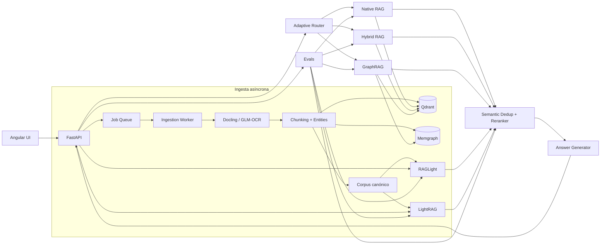

# Adaptive RAG & GraphRAG para Payment Knowledge

Esta PoC implementa una plataforma de conocimiento para payment processing con varias estrategias de RAG sobre el mismo corpus. El objetivo es poder cargar documentos, consultar evidencia, explorar relaciones de conocimiento y comparar de forma medible cómo cambia el ranking entre Native RAG, Hybrid RAG, RAGLight, GraphRAG, LightRAG y Adaptive Routing.

La versión v25 parte de la v24 validada end-to-end y agrega todas las mejoras P1 que quería probar: optimización de GLM-OCR para GPU de baja VRAM, ingesta asíncrona por jobs, deduplicación semántica de chunks, reranking común para todas las estrategias y evals avanzados para comparar ranking bruto contra ranking rerankeado. La interfaz Angular también quedó separada en cuatro áreas: RAG Playground, administración de documentos, explorador de grafo y Evals/Rankings.

## Qué agrega v25

### 1. Optimización de GLM-OCR

Antes de enviar una imagen al encoder multimodal de GLM-OCR, el backend normaliza orientación y resolución. El perfil por defecto limita el lado mayor a `1400` px y el total a `1.6M` píxeles, conservando aspecto. Las páginas PDF se rasterizan con una escala configurable y pasan por el mismo resize.

Variables principales:

```env
GLM_OCR_IMAGE_MAX_SIDE=1400
GLM_OCR_IMAGE_MAX_PIXELS=1600000
GLM_OCR_IMAGE_QUALITY=92
GLM_OCR_PDF_SCALE=1.5
```

El objetivo es reducir tokens visuales y latencia en una GTX 1650 de 4 GB sin cambiar el modelo GLM-OCR ni la configuración de vLLM que ya fue validada.

### 2. Ingesta asíncrona con jobs

La UI ya no necesita mantener abierto un request HTTP durante OCR e indexación. El flujo interactivo usa:

```text
POST /api/v1/documents/jobs
        |
        v
202 Accepted + job_id
        |
        v
worker interno
  parse/OCR
  chunking
  idempotencia
  Qdrant
  Memgraph
  corpus canónico
  RAGLight/LightRAG opcionales
```

Cada job expone `status`, `stage`, `progress`, resultado y error. Los snapshots se guardan bajo `.runtime/jobs`, por lo que un reinicio deja visible que un trabajo anterior fue interrumpido en vez de desaparecer silenciosamente.

Para la GTX 1650 dejo un solo worker por defecto para evitar dos inferencias OCR compitiendo por la misma GPU:

```env
INGESTION_JOB_WORKERS=1
INGESTION_JOB_QUEUE_SIZE=32
```

La ruta síncrona `POST /documents/ingest` se conserva para smoke tests, scripts y validaciones aisladas.

### 3. Deduplicación semántica de chunks

Todas las estrategias pasan por un postprocesador común antes de enviar evidencia al generador:

```text
retrieval de candidatos
        |
        v
embeddings del contexto
        |
        v
deduplicación semántica
        |
        v
reranking
        |
        v
Top K final
```

La deduplicación compara similitud coseno entre candidatos. El umbral base es:

```env
SEMANTIC_DEDUP_THRESHOLD=0.94
```

Esto evita gastar contexto en fragmentos prácticamente equivalentes provenientes de reingestas, motores distintos o documentos con contenido muy parecido.

### 4. Reranker común

Native RAG, Hybrid RAG, GraphRAG, RAGLight y LightRAG pueden entregar scores que no son directamente comparables. Por eso v25 agrega un reranker común basado en cuatro señales:

```text
65% similitud semántica query-context
20% cobertura lexical
10% score/rank original del motor
 5% cobertura de códigos y entidades relevantes
```

Los pesos son configurables:

```env
RERANK_SEMANTIC_WEIGHT=0.65
RERANK_LEXICAL_WEIGHT=0.20
RERANK_ORIGINAL_WEIGHT=0.10
RERANK_ENTITY_WEIGHT=0.05
```

Cada contexto devuelto incluye en `metadata` el `original_rank`, `original_score`, `semantic_score`, `lexical_score` y `rerank_score`. La UI los muestra dentro de la evidencia para poder ver cuándo un chunk subió o bajó.

### 5. Evals avanzados y comparativa de rankings

El dataset de evals pasó de 4 a 20 casos agrupados en categorías como `exact_code`, `semantic`, `compliance`, `relational` y `operations`.

Por cada estrategia se calcula:

- Hit Rate;
- MRR;
- nDCG@K;
- Recall@K;
- Precision@K por caso;
- latencia media;
- duplicados semánticos eliminados;
- routing accuracy para `auto`;
- MRR raw vs reranked;
- nDCG raw vs reranked;
- delta MRR;
- delta nDCG.

La UI muestra un leaderboard ordenado por MRR reranked, nDCG, Hit Rate y latencia. La comparación central no es solo "qué estrategia quedó arriba", sino si el reranker realmente mejoró el orden de la evidencia esperada.

Ejemplo conceptual:

| Estrategia | MRR raw | MRR reranked | Delta MRR | nDCG reranked | Hit Rate |
| --- | ---: | ---: | ---: | ---: | ---: |
| Hybrid RAG | 0.82 | 0.91 | +0.09 | 0.93 | 95% |
| GraphRAG | 0.79 | 0.88 | +0.09 | 0.90 | 90% |
| Native RAG | 0.76 | 0.84 | +0.08 | 0.86 | 90% |

Los valores anteriores son solo un ejemplo de cómo se renderiza el reporte. Los números reales salen de `POST /api/v1/evaluations/run` en cada entorno.

## UI

La aplicación Angular expone cuatro workspaces principales.

### RAG Playground

Permite seleccionar estrategia, Top K, activar/desactivar reranking y deduplicación, revisar evidencia y ver el trace completo del router y del ranking.

### Administrar documentos

Permite:

- cargar documentos mediante jobs asíncronos;
- observar etapa y porcentaje de cada job;
- listar documentos indexados;
- comparar cantidad de chunks en Qdrant y Memgraph;
- comprobar consistencia del canónico;
- reindexar un documento desde su Markdown canónico;
- eliminar un documento de Qdrant, Memgraph y el corpus canónico.

### Grafo de conocimiento

Muestra un overview navegable de entidades/relaciones de Memgraph y permite consultar el vecindario de una entidad concreta como `AUTORIZACION`, `EMISOR`, `ADQUIRENTE`, `PAYMENT` o `CONCILIACION`.

### Evals y rankings

Ejecuta todas las estrategias contra el dataset de evaluación y resalta:

- ranking raw;
- ranking después del reranker;
- delta MRR;
- delta nDCG;
- recall;
- hit rate;
- latencia;
- cantidad de chunks deduplicados;
- routing accuracy de Adaptive Routing;
- métricas por categoría.

## Caso funcional

El corpus incluido cubre:

- flujo de autorización;
- códigos ISO 8583 `05`, `51` y `91`;
- idempotencia y reintentos;
- timeouts;
- conciliación, clearing y settlement;
- PAN, CVV, PCI DSS y tokenización.

Las estrategias tienen objetivos diferentes:

| Estrategia | Enfoque |
| --- | --- |
| Native RAG | similitud semántica densa en Qdrant |
| Hybrid RAG | dense + lexical + Reciprocal Rank Fusion |
| GraphRAG | retrieval híbrido + expansión por relaciones en Memgraph |
| RAGLight | motor alterno aislado sobre Qdrant |
| LightRAG | motor graph-RAG alternativo |
| Adaptive Routing | elige Native, Hybrid o GraphRAG según señales de la consulta |

Después del retrieval, todas pasan opcionalmente por la misma deduplicación y reranking para que la comparación final sea consistente.

## Arquitectura



Los stores persistentes siguen siendo Qdrant y Memgraph. No agregué Kafka, PostgreSQL, MongoDB u otra infraestructura porque no son necesarias para demostrar estas mejoras P1. La cola de jobs es interna al backend y guarda snapshots en el volumen `.runtime`.

## Estructura principal

```text
adaptive-rag-payments-poc/
├── backend/
│   ├── src/pe/axiz/payment_knowledge/
│   │   ├── api/routes.py
│   │   ├── application/
│   │   │   ├── services.py
│   │   │   └── jobs.py
│   │   ├── evaluation/
│   │   │   └── metrics.py
│   │   ├── infrastructure/
│   │   │   ├── document_processing.py
│   │   │   ├── embeddings.py
│   │   │   ├── qdrant_store.py
│   │   │   └── memgraph_store.py
│   │   ├── retrieval/
│   │   │   ├── native.py
│   │   │   ├── graphrag.py
│   │   │   ├── raglight_adapter.py
│   │   │   ├── lightrag_adapter.py
│   │   │   ├── postprocessing.py
│   │   │   └── router.py
│   │   └── generation/llm.py
│   └── tests/
├── raglight_service/
├── datasets/
│   ├── sample_documents/
│   ├── ocr_samples/
│   └── evaluation/questions.json
├── frontend/
├── infrastructure/
│   ├── docker-compose.yml
│   ├── Dockerfile.ai
│   ├── Dockerfile.glm-ocr
│   ├── requests/
│   ├── responses/
│   └── scripts/smoke-test.sh
├── .env.example
├── environment.yml
├── pyproject.toml
└── README.md
```

## Tecnologías principales

| Componente | Versión |
| --- | ---: |
| Python | >=3.12,<3.14 |
| FastAPI | 0.141.1 |
| Uvicorn | 0.54.0 |
| Pydantic | 2.13.5 |
| Docling | 2.130.0 |
| GLM-OCR SDK | 0.1.5 |
| Pillow | 12.3.0 |
| vLLM Docker | 0.19.0 |
| Qdrant Server | 1.18.3 |
| qdrant-client backend | 1.19.1 |
| Memgraph | 3.13.1 |
| Neo4j Python Driver | 6.3.1 |
| RAGLight | 3.4.7 |
| LightRAG | 1.5.7 |
| Angular | 21.2.24 |
| TypeScript | 5.9.3 |
| Node | 22.x |

RAGLight continúa en un servicio Python separado porque su árbol de dependencias no se mezcla con Docling en el backend principal.

## Endpoints

| Orden | Método y endpoint | Uso |
| ---: | --- | --- |
| 1 | `GET /api/v1/health` | verificar Qdrant, Memgraph, RAGLight, LightRAG y GLM-OCR |
| 2 | `POST /api/v1/documents/jobs` | crear una ingesta asíncrona y obtener `job_id` |
| 3 | `GET /api/v1/jobs/{job_id}` | consultar progreso y resultado |
| 4 | `GET /api/v1/jobs` | listar jobs recientes |
| 5 | `GET /api/v1/documents` | administrar documentos indexados |
| 6 | `GET /api/v1/documents/{id}/index-state` | revisar consistencia idempotente |
| 7 | `POST /api/v1/documents/{id}/reindex` | reconstruir Qdrant/Memgraph desde canónico |
| 8 | `DELETE /api/v1/documents/{id}` | eliminar documento |
| 9 | `POST /api/v1/query` | ejecutar RAG + dedup + reranking + generación |
| 10 | `GET /api/v1/graph/overview` | obtener nodos/relaciones para la UI |
| 11 | `GET /api/v1/graph/neighborhood/{entity}` | expandir vecindario de entidad |
| 12 | `POST /api/v1/evaluations/run` | ejecutar evals y ranking comparativo |
| - | `POST /api/v1/documents/ingest` | ruta síncrona para scripts/smoke tests |
| - | `POST /api/v1/datasets/seed` | bootstrap manual opcional |
| - | `GET /docs` | Swagger |

## Ejecución completa con Docker

Copio primero el `.env`:

```bash
cp .env.example .env
```

Luego levanto todo:

```bash
docker compose -f infrastructure/docker-compose.yml up --build
```

La UI queda en:

```text
http://localhost:4200
```

Swagger:

```text
http://localhost:8000/docs
```

GLM-OCR/vLLM:

```text
http://localhost:8080/v1/models
```

El `dataset-seed` se ejecuta automáticamente y debe terminar con `Exited (0)`. El backend y el frontend permanecen disponibles mientras el seed continúa.

## Pruebas rápidas

### Health

```bash
curl http://localhost:8000/api/v1/health
```

### Crear job asíncrono

```bash
curl -X POST \
  "http://localhost:8000/api/v1/documents/jobs?index_external=false" \
  -F "file=@datasets/ocr_samples/documento_escaneado_prueba_ocr_pagos.jpg"
```

Respuesta inicial:

```json
{
  "job_id": "...",
  "status": "queued",
  "stage": "queued",
  "progress": 0,
  "source": "documento_escaneado_prueba_ocr_pagos.jpg"
}
```

Luego:

```bash
curl http://localhost:8000/api/v1/jobs/<job_id>
```

### Query con reranker y dedup

```bash
curl -X POST http://localhost:8000/api/v1/query \
  -H "Content-Type: application/json" \
  -d '{
    "question":"¿Qué significa el código 05 y qué debería revisar operaciones?",
    "strategy":"hybrid_rag",
    "top_k":5,
    "rerank":true,
    "deduplicate":true,
    "include_trace":true,
    "include_evidence":true
  }'
```

Dentro del trace aparece:

```json
{
  "ranking": {
    "candidates": 20,
    "duplicates_removed": 1,
    "reranked": true,
    "deduplicated": true
  }
}
```

### Evals y comparación de ranking

```bash
curl -X POST http://localhost:8000/api/v1/evaluations/run \
  -H "Content-Type: application/json" \
  --data-binary @infrastructure/requests/evaluation.json
```

La sección `ranking_comparison` contiene, por estrategia:

```json
{
  "strategy": "hybrid_rag",
  "raw_mrr": 0.80,
  "reranked_mrr": 0.90,
  "delta_mrr": 0.10,
  "raw_ndcg_at_k": 0.82,
  "reranked_ndcg_at_k": 0.92,
  "delta_ndcg_at_k": 0.10,
  "hit_rate": 0.95,
  "recall_at_k": 0.95,
  "avg_latency_ms": 42.0,
  "avg_duplicates_removed": 0.5
}
```

Los números del ejemplo no son resultados precalculados; la API los obtiene en runtime.

## Smoke test completo

Después de levantar el stack:

```bash
RUN_EVALUATION=true bash infrastructure/scripts/smoke-test.sh
```

La v25 comprueba adicionalmente:

- job asíncrono con HTTP 202;
- progreso y finalización del worker;
- idempotencia documental;
- reranking y deduplicación activados en Native RAG;
- `graph/overview` para la UI;
- ranking raw vs reranked en la evaluación;
- MRR, nDCG y Recall@K;
- dataset de evals ampliado.

La prueba OCR conserva timeout configurable:

```bash
OCR_TIMEOUT_SECONDS=900 RUN_EVALUATION=true \
  bash infrastructure/scripts/smoke-test.sh
```

## Desarrollo local con Conda

Creo el entorno:

```bash
conda env create -f environment.yml
conda activate axiz-adaptive-rag-payments
```

El entorno instala el backend mediante `pip` dentro de Conda. No uso `venv`. Para los contenedores se usa Python/Node nativo, sin Conda dentro de Docker.

Backend local:

```bash
axiz-api
```

Frontend local:

```bash
cd frontend
npm install
npm start
```

Para desarrollo local siguen siendo necesarios Qdrant, Memgraph y, si se quiere OCR local, el runtime GLM-OCR/vLLM.

## Validación del código

Pruebas backend:

```bash
pytest -q
```

RAGLight:

```bash
pytest -q raglight_service/tests
```

Compilación Python:

```bash
python -m compileall backend/src datasets raglight_service/src
```

La validación GPU real debe ejecutarse en un host con NVIDIA. El smoke test es la prueba de aceptación del stack completo.
